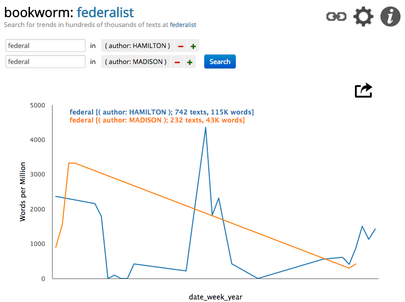

# Introduction to Bookworm

Bookworm is an open-source data visualization package that helps reveal trends in plaintext documents over time. The following guide will walk users through the steps required to create a Bookworm instance from source code on a Linux server. At the end of the guide, you should have an interactive web page that looks like the image above.

## Getting Started with Amazon Web Services

To get started, we will need access to a Linux server. To do so, we'll [register for an account](aws.amazon.com/free) with Amazon Web Services (AWS), which gives students one year of free services. After registering, you'll be able to create Linux servers with just a few mouse clicks by following this step-by-step guide to [creating an Ubuntu 14.04 m4.large instance](https://github.com/YaleDHLab/lab-workshops/wiki/Creating-an-EC2-Instance-on-AWS).

## Connecting to your AWS Instance

Once you have created an Ubuntu instance, the next step is to connect to the server. To do so, you can follow this guide on [connecting to an EC2 instance](https://github.com/YaleDHLab/lab-workshops/wiki/Connecting-to-an-EC2-Instance).

## Building a Bookworm

Finally, once you've connected to your EC2 instance, you'll be prepared to build a bookworm. You can do so by following this guide on [building a Bookworm on an EC2 instance](https://github.com/YaleDHLab/lab-workshops/wiki/Installing-Bookworm-on-an-Ubuntu-14.04-EC2-Instance).

## Questions or Difficulties

If you have any questions on the process of building a bookworm, or encounter any difficulties as you do so, please feel free to [open an issue](https://github.com/YaleDHLab/lab-workshops/issues) and we'll be happy to help!

