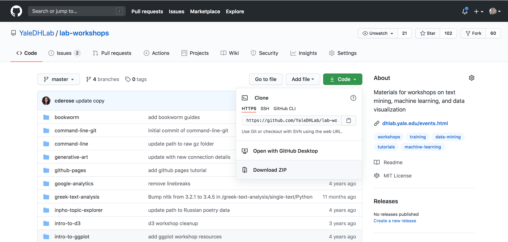

# First Steps with Python

This workshop offers a gentle introduction to the Python programming language. By working through this workshop, users will come to learn some of the most important building blocks in Python, and will have a chance to start creating simple but powerful Python programs on their own.

## Getting Started

The following steps will prepare you to get started with this workshop.

**Step One: Install Anaconda**

To get started with this notebook, you should first [install the Anaconda distribution of Python](https://www.anaconda.com/products/individual#Downloads).

**Step Two: Download Workshop Notebook**

Once Anaconda is installed, you'll need to download the notebook for this workshop. To do so, you can visit https://github.com/YaleDHLab/lab-workshops, click the green "Code" button at the top of the page, then click the "Download ZIP" button:



Save that zip archive to your Desktop, then double click the zip archive to expand it.

**Step Three: Start a Terminal**

Next, you'll need to start a terminal. The method for starting a terminal will differ based on your operating system:

| Operating System | Command                                            |
|---------|-------------------------------------------------------------|
| Mac     | type COMMAND+SPACE_BAR, type <i>terminal</i>, and hit ENTER |
| Windows | go to Programs/Apps -> Anaconda3 -> Anaconda Prompt         |

**Step Four: Move Terminal to Lab Workshops Folder**

Once your terminal is running, we need to move the terminal into the "lab-workshops" folder on your desktop. To accomplish this goal, we can use the "cd" command. The "cd" command stands for "change directories" (directory is a fancy term for a folder). Specifically you should run the command below that corresponds to your operating system:

| Operating System | Command                             |
|------------------|-------------------------------------|
| Mac              | `cd ~/Desktop`                      |
| Windows          | `cd C:\Users\YOUR_USERNAME\Desktop` |

Note that Windows users will need to replace YOUR_USERNAME above with your username on your computer.

**Step Five: Start the Workshop Server**

Now that your terminal is on your desktop, we can start the notebook by running the following command in your terminal:

```bash
jupyter notebook
```

This command should open a webpage with several folders. Click the folder that says "first-steps-with-python", then click the file labelled "first-steps-with-python.ipynb". Once you've finished this step, you'll be ready to work through this workshop!