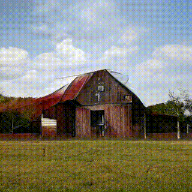

# Creating Art with Neural Networks

## Getting Started with Google Colab Notebooks

This workshop uses a series of Google Colab notebooks, which let you use GPU-accelerated computing in controlled environments without having to acquire special hardware or software.

#### Opening a Sample Colab Notebook

To use Google Colab notebooks, one needs to have a Gmail account. If you don't have a Gmail account, please sign up for one before continuing. Then, to launch a notebook, log in to your Google account, then click the "Open in Colab" buttons below to open the linked notebook. Here's an example button:

Click the button above to load our first notebook. If you are not logged into a Google account, you may get a response that looks like this:

If you get a 400 response, please log into your Google account then click the "Open in Colab" button again.

#### Running a Sample Colab Notebook

Once the sammple notebook is open, click the "Open in Playground" button in the upper-left-hand corner of the screen:

---

---

After clicking that button, click the "Connect" button in the navbar:

---

---

Scrolling down you should find that the notebook is comprised of several blocks of code and documentation. Each of these blocks is refered to as a "cell". To run the code in a cell, click the "play" button next to that cell. After running a cell, you may be prompted with a message indicating that the loaded notebook was not created by Google. If that message appears, keep "reset all runtimes" checked and click "Run Anyway" to execute the code in that cell.

Once you've run a single cell, you should be able to continue through the notebook in this way, clicking the play button aside each cell to execute the code in that cell. In this way you can run code in the cloud with free GPU acceleration!

Now that we understand Colab notebooks, let's dive into the code below.

## Making Images with Autoencoders

In this notebook we'll get an intuitive sense of the way an [autoencoder](https://en.wikipedia.org/wiki/Autoencoder) works. Then we'll build, train, and run a very basic autoencoder to generate new face images.

## GPT-2 (Text)

[GPT-2](https://d4mucfpksywv.cloudfront.net/better-language-models/language_models_are_unsupervised_multitask_learners.pdf) is a powerful algorithm capable of generating delightfully bizarre text outputs. We'll use this notebook to create some algorithmic poetry.

**Sample Outputs:**

> A 20-year-old woman was physically raised in attic shed bags and handles. A 22-year-old man attended Duffel Island Medical Clinic treating a "sometimes debilitating issue", believed to be an underlying condition.

> Robin Hodgson, whose 17-bedroom apartment was 'identified in a similar manner to some of the areas the home does not have', and who lived close to the scene of the killings on 18 January, said they were 'ordinary household items', just like animals.

> Dream true and fill the soul of High Ketchup@

## Textgenrnn (Text)

Textgenrnn is a [recurrent neural network](https://en.wikipedia.org/wiki/Recurrent_neural_network) that lets users generate texts that resemble an input text. The sample outputs below, for example, are based on Shakespeare's plays:

**Sample Outputs:**

> DUKE VINCENTIO:  
> What was not all the sup sound the sea,  
> What is the more of thy strange marriage.  

> LUCIO:  
> I was born to the duke of mine own brother with the world be so fair a man to do the court.  

> HASTINGS:  
> Let's best lace?  

## BigGAN (Images)

[BigGAN](https://arxiv.org/abs/1809.11096) is a Generative Adversarial Network that is capable of generating large images. The default notebook allows one to explore this model and generate outputs like the ones below:

By feeding the model different paramters, one can generate more abstract images:

By exploring the model's latent space, one can also generate many image outputs then combine them into a video like the ones below:

<table>
  <tr>
    <td></td>
    <td></td>
  </tr>
</table>

## Multitrack Chords (Music)

Multitrack Chords is an interactive web application built by Google's [Magenta](https://magenta.tensorflow.org/) team, which specializes in building AI tools for audio production. This application uses a neural network to generate new music that conforms to user-specified chordal patterns and style imperatives:

## Performance RNN (Music)

Like Multitrack Chords, Performance RNN is a tool built by Google's Magenta team that allows users to create new audio compositions. This model is trained on jazz sequences, so tends to be a bit more dissonant than the melodic multitrack chords outputs:

## GANSynth (Music)

GANSynth is a third and final Google Magenta application that allows users to generate audio with nerual networks. This application lets users modulate the timber of input sequences by using a series of neural network modulations:

