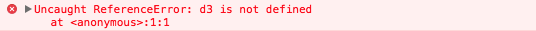
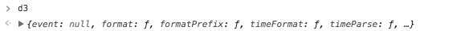
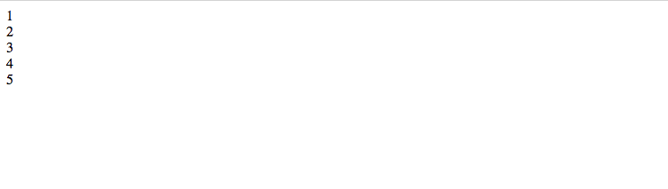
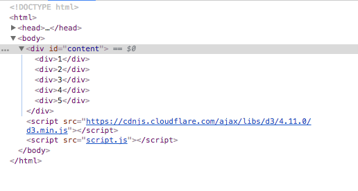
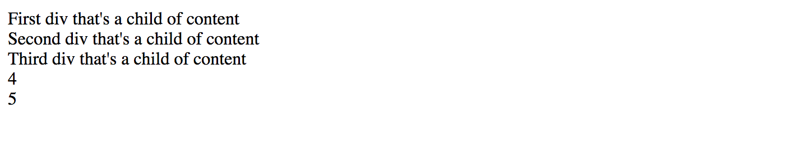
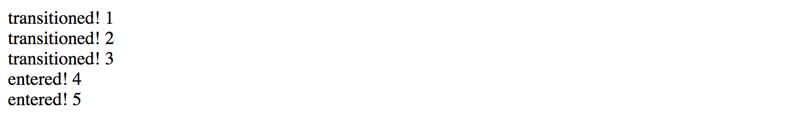

# Introduction to D3

D3.js is a popular JavaScript library that renders data to SVG or to an HTML canvas element in a 2D context. This session is meant to give a very quick overview of a some core D3 concepts.

## Getting Set Up

D3 creates interactive content for web pages, so to get started we need to set up your machine for web-development related work. To do so, let's follow this [guide to setting up your machine for web programming](https://github.com/YaleDHLab/lab-workshops/wiki/Setting-up-your-machine-for-web-development).

You should now have three files on your Desktop: `index.html`, `style.css`, and `script.js`, and you should have a web server serving that content on port 7000. If that's not the case, let us know so we can help you!

## Loading D3 onto a Web Page

To get started with D3, we'll first need to load the library into our web page. Let's do so by updating index.html so it looks like this:

```html
<!DOCTYPE html>
<html>
  <head>
    <meta charset='UTF-8'>
    <title>Hello There!</title>
    <link href='style.css' rel='stylesheet'>
  </head>
  <body>
    <div id='content'></div>
    <script src='https://cdnjs.cloudflare.com/ajax/libs/d3/4.11.0/d3.min.js'></script>
    <script src='script.js'></script>
  </body>
</html>
```

Now let's refresh the page, type `d3`, and hit enter. If you get output like the following, then something has gone wrong and D3 is not loaded on your page:



If your output looks like the image above, check to make sure your `index.html` file looks exactly like the `index.html` file above.

Once D3 is loaded on your page, you should be able to refresh the page, type `d3`, hit enter, and get output like the following:



Once you get this output you're ready for the next section!

## Selecting Elements

As we saw in the [Introduction to Javascript](https://github.com/YaleDHLab/lab-workshops/tree/master/intro-to-javascript) session, one can select elements on a web page using ordinaly JavaScript. To select the body tag of a web page, for instance, we can use:

```javascript
document.querySelector('body');
```

The syntax for selections in D3 is similar:

```javascript
d3.select('body');
```

We can chain additional methods to these selections. For example, we can change the background color of the body tag:

```javascript
document.querySelector('body').style.background = 'orange';
```

Here's the same method chaining in D3:

```javascript
d3.select('body').style('background', 'orange');
```

In the examples above, we select the body tag by its tag name. One can also select elements by their class or id attributes. Here's a brief overview of some different selection types we can perform:

| Select By | Sample Tag | D3 Example |
| --- | --- | --- | --- |
| tag | `<div>These</div>` | `d3.select('div')` |
| class | `<span class='active'>are</span>` | `d3.select('.active')` |
| id | `<header id='#nav'>examples</header>` | `d3.select('#nav')` |

Mike Bostock, the creator of D3.js, posted a more [thorogh overview of selectors](https://bost.ocks.org/mike/selection/) if you want to learn more.

**Selecting Multiple Elements**

`d3.select()` only selects the first element that matches the specified selector. To select all elements that match a selector, use `d3.selectAll()` instead. For example, to change the color of all elements with the active class on a page, we can use:

`d3.selectAll('.active').style('background', 'purple')`

## Adding an Element to a Web Page

We've previously discussed one way to add an element to a web page:

```javascript
document.querySelector('body').appendChild( document.createElement('new-element') )
```

If you run that line on an empty page, you'll see it creates a new tag `new-element`. To achieve the same in D3, we could run:

```javascript
d3.select('body').append('new-element')
```

To add attributes to the new element in D3, we can just add some additional methods to the method chain:

```javascript
d3.select('body').append('new-element').text('hi!').style('background', 'orange')
```

## Adding Multiple Elements to a Web Page

To get started, let's remind ourselves how to add data to a web page without D3. To do so, type the following into `script.js`:

```javascript
var data = [1,2,3,4,5];
```

Here we assign a list of integers to a variable named `data`. Let's now reuse some of the JavaScript we covered in [Introduction to Javascript](https://github.com/YaleDHLab/lab-workshops/tree/master/intro-to-javascript) to render each of these numbers on a web page:

```javascript
var data = [1,2,3,4,5];

// Add a new div to the page for each value in `data`
data.forEach(function(d) {
  var div = document.createElement('div');
  div.innerHTML = d;
  document.querySelector('#content').appendChild(div);
})
```

This creates a page that looks like this:



If you past the content above into `script.js`, refresh your page, and click the **Elements** tab of your Chrome developer tools, you can see the new structure of your web page:



As we can see, the div with the id **content** has five div children, each with the appropriate integer as its content.

To build the same HTML structure with D3, we could do this:

```javascript
data.forEach(function(d) {
  d3.select('#content').append('div').text(d)  
})
```

Here we're just looping over the elements in `data`, and for each of those elements, we're adding a new `div` tag to the element with the id `content`. 

***

**Quiz Time!**

Given what we've covered above, see if you can use D3 to add four `<p>` tags to your page, each with a different word as its inner HTML content.

*Hint: words in JavaScript need to have quote marks around them, like this:*  
`var words = ['hello', 'there!']`.

***

## Create, Edit, and Delete Content with Data Bindings

In the example above, we examined one way to add multiple items to a page with D3. Usually, though, when programming D3 one would not use the approach above to add multiple elements to a page. Instead, one would create a **data binding** by specifying some data to bind to some elements. Given that data binding, it's easy to add, update, or delete content as the data changes.

Data bindings are the most important D3 concept to understand, so let's dig in with some sample code:

```javascript
var data = [1,2,3,4,5];

d3.select('#content').selectAll('div').data(data).enter()
  .append('div')
    .text(function(d) { return d; })
```

If you refresh your page, you'll see it looks just like it did when we ran the code above. But what on earth is going on here? Let's explain each section of this code:

**`d3.select('#content')`**  

This function selects the element on the current web page with the id **content**. The purpose of this line is similar to that of `document.querySelector('#content')`, namely this line creates some selection that we can use to add, modify, or remove elements within the selection.

**`.selectAll('div')`**  

This function selects all children of `d3.select('#content')` with the element type *div*. Because this is the final `select()` statement in the chain, this function determines the current selection on which we'll perform the changes below.

**`.data(data)`**  

This function binds some data to the current selection. In other words, it creates a **data binding** by indicating the data we want to use while we work with the current selection. In the case above, we bind the list `[1,2,3,4,5]` to the selection.

**`.enter()`**  

This function indicates we are going to use the data bound to the current selection to *add* some elements to the web page (as opposed to *updating* or *removing* extant elements in the current selection)

**`.append('div')`**  

This function adds a new `div` element to `#content` for each item in `data`. The elements are added to `#content` because that element is the first element selected in the selector chain. If we had used `d3.select('body').selectAll...` instead, we would add the new divs to the body tag of the page.

**`.text(function(d) { return d; })`**  

This function updates the text content of each div added within the current `.enter()` block.  

### The Enter Block

The `.enter()` function discussed above works by comparing the items in `data` to the elements selected via `d3.select('#content').selectAll('div')`. Put simply, **the enter block runs once for each item in `data` that is not yet in the selected HTML**. 

When we load the page, there are 5 elements in data, but 0 div elements that are children of `#content`. We will therefore go through the `.enter()` block 5 times, which creates 5 divs that have `#content` as their parent.

To better understand how `.enter()` works, add three div tags to your `<div id='content'>` tag:

```html
<div id='content'>
  <div>First div that's a child of content</div>
  <div>Second div that's a child of content</div>
  <div>Third div that's a child of content</div>
</div>
```

If you refresh the page, you'll see the D3 code you typed above only adds two new divs to the page:


 
Why does the `.enter()` block only add two elements? Because `data` contains 5 elements, `d3.select('#content').selectAll('div')` returns 3 elements, and the `.enter()` block only triggers once for each item in `data` that's not yet represented in the HTML selection!

---

**Quiz Time!** Suppose a page contains the following HTML:

```html
<ul>
  <li>HTML</li>
  <li>CSS</li>
  <li>JavaScript</li>
</ul>
```

How many elements will the following code add to that HTML?

```javascript
var data = ['HTML', 'CSS', 'JavaScript', 'SVG'];

d3.select('ul').selectAll('li').data(data).enter()
  .append('li')
  .text(function(d) { return d; })
```

For the answer, run the following line in the console of your developer tools:

```
atob("MSwgYmVjYXVzZSBvdXIgZGF0YSBoYXMgNCBlbGVtZW50cyBhbmQgb3VyIGRhdGEgc2VsZWN0aW9uIGFscmVhZHkgaGFzIDMgZWxlbWVudHM=")
```

---

### The Transition Block

The `.enter()` block runs once for each item in `data` that is not yet in the selected HTML.  
**The `.transition()` block runs once for each item in `data` that *is* already in the selected HTML.**

Let's try out a transition block. Update your HTML so the div with an id of `content` looks like this:

```html
<div id='content'>
  <div>First div that's a child of content</div>
  <div>Second div that's a child of content</div>
  <div>Third div that's a child of content</div>
</div>
```

Then let's run the following D3:

```javascript
var data = [1,2,3,4,5];

var selection = d3.select('#content').selectAll('div').data(data)

// Enter block
selection.enter()
  .append('div')
    .text(function(d) { return 'entered! ' + d; })

// Transition block
selection.transition()
  .text(function(d) { return 'transitioned! ' + d; })
```

Running this code adds two new elements to the end of the list like before, but it also **transitions** or updates the first three elements of the list:



### The Exit Block

The `.enter()` block runs once for each item in `data` that is not yet in the selected HTML.  
The `.transition()` block runs once for each item in `data` that *is* already in the selected HTML.
**The `.exit()` block runs once for each item in the selected HTML but not in `data`.**

Let's try out an exit block. Update your HTML so the div with an id of `content` looks like this:

```html
<div id='content'>
  <div>First div that's a child of content</div>
  <div>Second div that's a child of content</div>
</div>
```

Then let's run the following D3:

```javascript
var data = [1];

var selection = d3.select('#content').selectAll('div').data(data)

// Enter block
selection.enter()
  .append('div')
    .text(function(d) { return 'entered! ' + d; })

// Transition block
selection.transition()
  .text(function(d) { return 'transitioned! ' + d; })

// Exit block
selection.exit()
  .remove()
```

When this code executes, the `.enter()` block will not get entered, as there is only one item in `data` and there are already two items in the selected HTML.

However, because there is one item in the data and there is one item in the selected HTML, the `.transition()` block will get entered once, which updates the first line of the HTML.

Finally, we're left with one item in the HTML that has no counterpart in `data`. This will cause that HTML element to enter the `.exit()` block, wherein we call the `.remove()` method to remove the element from the page.

Here's the resulting HTML:


---

**Quiz Time!** Suppose a page contains the following HTML:

```html
<ul>
  <li>HTML</li>
  <li>CSS</li>
  <li>JavaScript</li>
</ul>
```

How many `li` elements will remain in that `ul` tag after we run the following HTML?

```javascript
var data = ['SVG'];

var selection = d3.select('ul').selectAll('li').data(data)

selection.enter()
  .append('li')
  .text(function(d) { return d; })

selection.transition()
  .text(function(d) { return d; })

selection.exit()
  .remove()
```

For the answer, run the following line in the console of your developer tools:

```
atob("SnVzdCBvbmUgKCJTVkciKSwgYmVjYXVzZSBvdXIgZGF0YSBjb250YWlucyBvbmx5IG9uZSBpdGVt")
```

---

# Next Steps

Great work! Next let's discuss [working with SVG in D3](https://github.com/YaleDHLab/lab-workshops/blob/master/intro-to-d3/working-with-svg.md).