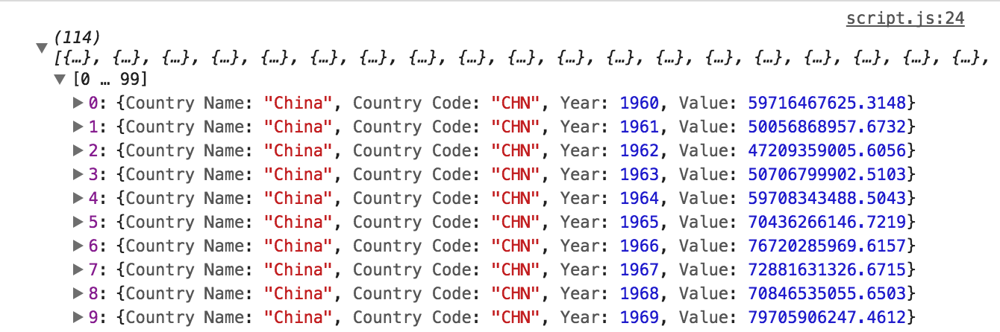
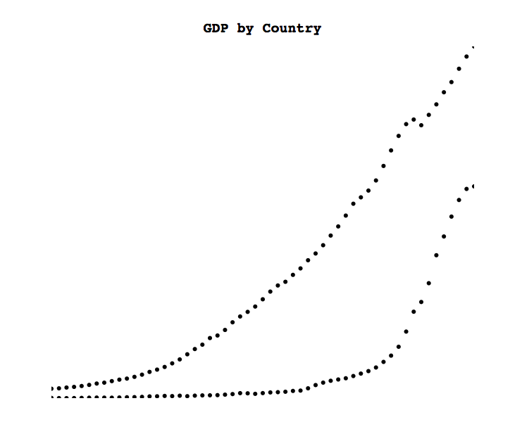
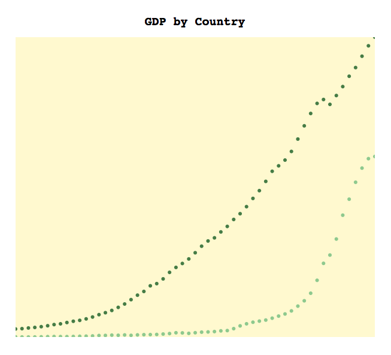
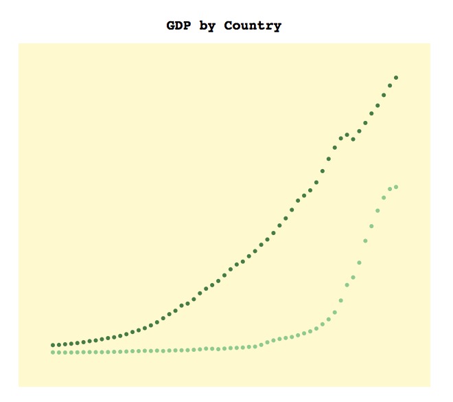
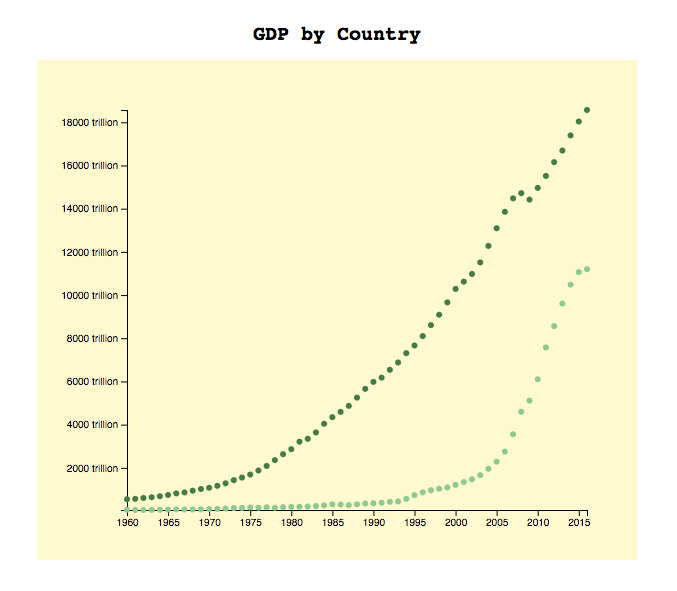
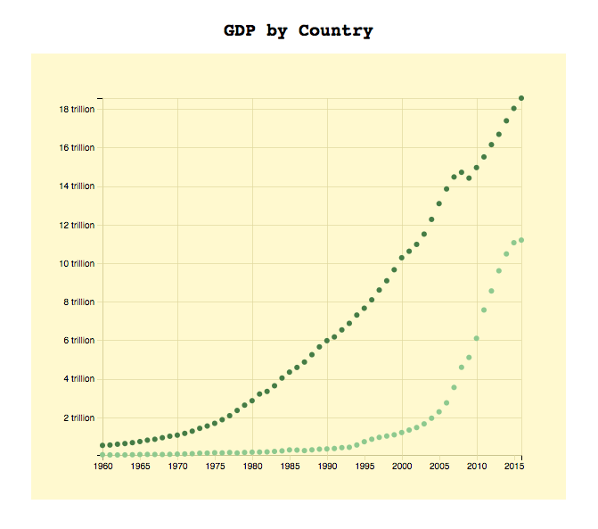
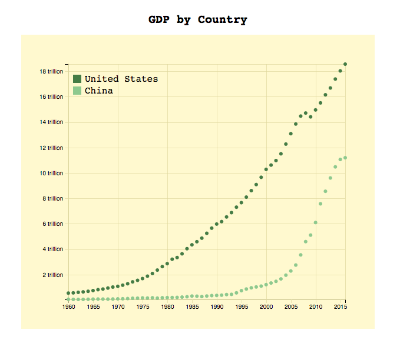

# Let's Make a Chart!

Having examined some of the building blocks of D3 charts above, let's now build a proper chart. Doing so will introduce more complexity into the code, but will help show how one might go about building a chart "in the wild".

### Loading Data

Usually when creating a D3 chart, one begins by preparing some data into a CSV or JSON file. For this work, we'll use [this JSON file](https://s3-us-west-2.amazonaws.com/lab-workshops/intro-to-d3/gdp.json), which documents the GDP of the United States and China over the last fifty years or so.

D3 makes it easy to read a JSON file like this into a web page:

```javascript
var url = 'https://s3-us-west-2.amazonaws.com/lab-workshops/intro-to-d3/gdp.json'
d3.json(url, function(data) {
  console.log(data)
})
```

The data looks like this:

```javascript
[
  {
    "Country Name": "China",
    "Country Code": "CHN",
    "Year": 1960,
    "Value": 59716467625.3148
  },
  {
    "Country Name": "China",
    "Country Code": "CHN",
    "Year": 1961,
    "Value": 50056868957.6732
  }, ...
]
```

Each observation is a JavaScript Object with attributes that describe the GDP of either China or the United States in a given year. In what follows below we'll use the `Year` for the x-axis, the `Value` for the y-axis, and the `Country Name` for the color scale.

### Building the Chart Foundations

Let's start the chart by building the HTML shell:


```html
<!DOCTYPE html>
<html>
  <head>
    <meta charset='UTF-8'>
    <title>GDP by Country</title>
    <link href='style.css' rel='stylesheet'>
  </head>
  <body>
    <h1>GDP by Country</h1>
    <script src='https://cdnjs.cloudflare.com/ajax/libs/d3/4.11.0/d3.min.js'></script>
    <script src='script.js'></script>
  </body>
</html>
```

Let's also ensure the file `style.css` contains the following basic styles:

```css
* {
  margin: 0;
  padding: 0;
  box-sizing: border-box;
}

body,
html {
  width: 100%;
  height: 100%;
  overflow: hidden;
}

svg {
  display: block;
  margin: 0 auto;
}

h1 {
  font-family: courier;
  text-align: center;
  font-size: 20px;
  margin: 30px 0 15px;
}
```

Once those files are set, we can turn to the D3 code. To start the chart, let's specify the chart dimensions, add an SVG element to the page, and load the data to be plotted:

```javascript
// Define the chart width and height
var width = 600;
var height = 500;

// Build the SVG
var svg = d3.select('body').append('svg')
  .attr('width', width)
  .attr('height', height)

/**
* Load Data
**/

// Specify the url where the data lives
var url = 'https://s3-us-west-2.amazonaws.com/lab-workshops/intro-to-d3/gdp.json'

// Load the json and pass the result to the render() function
d3.json('data/gdp.json', render)

/**
* Main render function
**/

function render(data) {
  console.log(data)
}
```

If you type that content into `script.js`, reload the page, and open your developmer tools, you should see the data displayed in your console:



We'll need the data to proceed, so if you don't see the data in your console, try copying the code above again before moving on.

### Creating Data Scales

The first step in creating a D3 chart is creating the **data scales**. Scales provide a mapping from input data units to chart units. In the present chart, we want to use each observation's `Year` attribute to position the observation along the x-axis. We must therefore create a scale that converts each observation's `Year` attribute to a value between 0 and 600 (the width of the chart).

D3 makes it relatively easy to create a function that automatically runs this conversion. To create that function, we need to specify two things: the function's **domain** (or input) and the function's **range** (or output).

To provide a *linear* mapping from the domain to the range, we can determine the smallest and largest `Year` attributes within the dataset, and the smallest and largest x-axis values the chart will display. We can then use those values as the `domain` and `range` for the scale, respectively.

D3 provides a helper function that can determine the smallest and largest values in a given array:

```javascript
d3.extent([1,2,3,4,5]) // returns [1,5]
```

If the input array is a list of objects, one can provide an `attribute accessor` function that returns the values to be passed into the extent call, like this:

```javascript
d3.extent(data, function(d) {
  return d.Year;
})
```

Let's see it in action:

```javascript
function render(data) {
  var xDomain = d3.extent(data, function(d) {
    return d.Year;
  })
  console.log(xDomain); // returns [1960, 2016]
}
```

This means that the smallest `Year` attribute in `data` is 1960, and the largest is 2016. Now we know the smallest and largest values among the inputs.

We also know the smallest and largest values among the outputs, as we wish to start the x-axis at value 0 and end it at value 600 (the width of the chart). We can therefore build our first scale:

```javascript
function render(data) {
  var xScale = d3.scaleLinear()
    .domain(d3.extent(data, function(d) { return d.Year; }))
    .range([0, width])

  // Determine where on the x-axis to place the year 1960
  console.log( xScale(1960) ); // returns 0
}
```

We expect the smallest of our input values to match the smallest of our output values exactly, and indeed it does!

Let's build another scale the maps our y-axis inputs to the y-axis coordinates:

```javascript
function render(data) {
  var xScale = d3.scaleLinear()
    .domain(d3.extent(data, function(d) { return d.Year; }))
    .range([0, width])

  var yScale = d3.scaleLinear()
    .domain(d3.extent(data, function(d) { return d.Value; }))
    .range([height, 0])
}
```

Great! We now have scales for the x and y axes.

### Initial Render

Now let's finish the render method by rendering each of the data points:

```javascript
function render(data) {

  // Set the X-Axis scale
  var xScale = d3.scaleLinear()
    .domain(d3.extent(data, function(d) { return d.Year; }))
    .range([0, width])

  // Set the Y-Axis scale
  var yScale = d3.scaleLinear()
    .domain(d3.extent(data, function(d) { return d.Value; }))
    .range([height, 0])

  // Create data binding
  var selection = svg.selectAll('circle').data(data)

  // Enter block
  selection.enter()
    .append('circle')
    .attr('cx', function(d) { return xScale(d.Year) })
    .attr('cy', function(d) { return yScale(d.Value) })
    .attr('r', 3)
}
```

You should see something like this [[full code](https://codepen.io/duhaime/pen/qVMmjL)]:



### Adding Some Color

The chart is off to a great start, but it's rather lifeless. Let's color the background and each country's observations.

Coloring the chart background is easy; we can just add a `.style()` call to the lines that initialize the SVG:

```javascript
// Build the SVG
var svg = d3.select('body').append('svg')
  .attr('width', width)
  .attr('height', height)
  .style('background', 'lemonchiffon') 
```

Next we can specify the colors to use for each country. The D3 way to do so is to create an **Ordinal scale**. Unlike linear scales (in which the domain is continuous), ordinal scales have a domain that's discrete. In other words, ordinal scales take as input a finite list of values, and they map those values to a finite list of output values. In our case, the color scale will take as input a country's name and return a CSS hex color for that country:

```javascript
function render(data) {
  
  // Create an object with one key for each `Country Name`
  var countries = {};
  data.map(function(d) {
    countries[ d['Country Name'] ] = true;
  })
  
  // Create an ordinal scale from `Country Name` to CSS color
  var colorScale = d3.scaleOrdinal()
    .domain(Object.keys(countries))
    .range(['#8cca8c', '#437d43']) 

  [...]
}
```

If you rerender the chart, you'll now see it has a little more personality [[full code](https://codepen.io/duhaime/pen/EbemGG)]:



### Adding Margins

Right now the chart starts in the lower-left-hand corner of the SVG ans runs all the way to the upper-right-hand corner. Usually, though, there's some **margin** between the chart boundaries and the SVG boundaries. Let's add some margins to the chart.

In the D3 world it's conventional to declare chart margins all the way at the beginning of the chart, then use those margins to set the sizes of elements throughout the script. Let's stick with tradition:

```javascript
// Define the margin area between SVG border and chart content
var margin = {top: 50, right: 50, bottom: 50, left: 50}

// Define the chart width and height
var width = 600 - margin.right - margin.left;
var height = 500 - margin.top - margin.bottom;

// Build the SVG
var svg = d3.select('body').append('svg')
  .attr('width', width + margin.right + margin.left)
  .attr('height', height + margin.top + margin.bottom)
  .style('background', 'lemonchiffon')

// Add a group element that will contain the chart content
var g = svg.append('g')
  .attr('transform', 'translate(' + margin.left + ',' + margin.top + ')')
```

That last element is new. It's a [`g` element](https://developer.mozilla.org/en-US/docs/Web/SVG/Element/g) (short for **group element**), which is a special kind of SVG element that can contain multiple additional elements. You'll see lots of them if you look at other D3 charts, because they're super helpful for containing lots of children in one tidy element.

The code above applies adds a `transform: translate()` attribute to the group. In short, the [`translate(x, y)` ](https://developer.mozilla.org/en-US/docs/Web/CSS/transform-function/translate) attribute shifts an element on a web page rightwards by `x` pixels and downwards by `y` pixels. In the code above, we shift the group element named `g` to the right by `margin.left` pixels and downwards by `margin.top` pixels. Doing so will create the margin around the chart content.

After creating the `g` element, we can append each `circle` to that element to ensure they all stay within the group's boundaries and don't reach all the way to the SVG edge:

```javascript
  // Changed from svg.selectAll()
  var selection = g.selectAll('circle').data(data)
```

The result is a chart with nice margins [[full code](https://codepen.io/duhaime/pen/KyxqKo)]:



## Adding Axes

So far so good, but it's still not clear what the units of the chart are, as there are no axes. Let's add some axes!

To add an axis, we first need to create some `g` elements that will contain the children elements for each axis:

```javascript
// Add the x and y axes. Note that the x axis needs to be translated to the chart bottom
var xAxis = g.append('g')
  .attr('transform', 'translate(0,' + height + ')')

var yAxis = g.append('g')
```

Then, inside the `render()` function, we can simply call the `.call()` method on each axis, pass in the appropriate axis scale, and the axes will render:

```javascript
// Call the "call()" method on each axis to render the axis
xAxis.call( d3.axisBottom(xScale) );
yAxis.call( d3.axisLeft(yScale) );
```

If you run those lines, you'll see that the x-axis labels have commas in them, and the y-axis values have 10 digits or so, which is almost impossible to read. Luckily, D3 allows one to format the labels for each axis. To do so, we can create a function that takes as input the raw axis value and returns the axis value as we wish to have it displayed.

For example, to remove the commas in the x-axis year values, we can call `parseInt()` on each year, which will convert the year value into an integer:

```javascript
function formatXTick(d) {
  return parseInt(d);
}
```

Likewise, we can create a function that divides each y-axis value by 1-trillion and appends the string 'trillion' to the resulting value:

```javascript
// Helper function that formats the y axis ticks
function formatYTick(d) {
  return (d/1000000000000) + ' trillion'
}
```

We can then add those formatting functions to the lines that render the axes inside the `render` function:

```javascript
// Call the "call()" method on each axis to render the axis
xAxis.call( d3.axisBottom(xScale).tickFormat(formatXTick) );
yAxis.call( d3.axisLeft(yScale).tickFormat(formatYTick) );
```

The result has some nice looking axes [[full code](https://codepen.io/duhaime/pen/LOJLjG)]:



### Adding Gridlines

One feature that can help make it easier for users to scan charts are **gridlines**, or little lines that show the extrapolation of the axis units across the chart. Let's add some gridlines to the chart.

First things first, we'll want to add some `group` elements to the page that will contain the x and y axis grid lines, just as we did for the axes above:

```javascript
// Add a group element that will contain the grid lines
var grid = g.append('g')

// Add group elements for the x and y grid lines
var xGrid = grid.append('g')
  .attr('class', 'x grid')
  .attr('transform', 'translate(0,' + height + ')')

var yGrid = grid.append('g')
  .attr('class', 'y grid')
```

Then, inside the render loop, we can use the `.call()` method on `xGrid` and `yGrid` to render grid lines for each. Inside the `xGrid`, one can use `.tickSize(-height)` to ensure that each grid line spans the full height of the chart. One can also use `.tickFormat('')` to ensure each tick renders no text content:

inside the render loop

```javascript
  // Add the grid lines
  xGrid.call(
    d3.axisBottom(xScale)
      .ticks(5)
      .tickSize(-height)
      .tickFormat('')
  )

  yGrid.call(
    d3.axisLeft(yScale)
      .ticks(10)
      .tickSize(-width)
      .tickFormat('')
  )
```

Finally, we can improve the gridline styles by adding a little CSS to the page:

```css
line,
.grid .domain {
  stroke: #e0d99a;
  stroke-opacity: 0.7;
  shape-rendering: crispEdges;
}
```

After adding these lines, we get some nice looking gridlines [[complete code](https://codepen.io/duhaime/pen/mqGwYp)]:



## Adding a Legend

Finally, we can add a legend to the chart so users can tell which color represents which country.

Once again, we'll start by adding a `group` element at the start of `script.js`:

```javascript
var legend = g.append('g')
  .attr('transform', 'translate(8, 18)')
```

Then with just a single function we can create one `rect` and one `text` element for each of the countries, and we can use the index position `idx` of each country to position those elements within the chart:

```javascript
// Add the legend items 
Object.keys(countries).sort().reverse().forEach(function(country, idx) {
  legend.append('rect')
    .style('width', 14)
    .style('height', 14)
    .style('fill', colorScale(country))
    .attr('y', idx * 20)
   legend.append('text')
    .text(country)
    .attr('x', 20)
    .attr('y', (idx * 20) + 12)
    .style('font-family', 'courier')
})
```

And at last, we have a decent looking chart [[full code](https://codepen.io/duhaime/pen/zPJdvq)]:



## Going Further

We've reached the end of our tutorial, but we've barely scrateched the surface of what's possible with D3.js. To go further, you might want to check out any of the following resources:

* [D3.js course on Udacity](https://www.udacity.com/course/data-visualization-and-d3js--ud507)  
* [Searchable gallery of D3.js visualizations](http://blockbuilder.org/search)  
* [D3.js example charts](https://github.com/d3/d3/wiki/Gallery)  