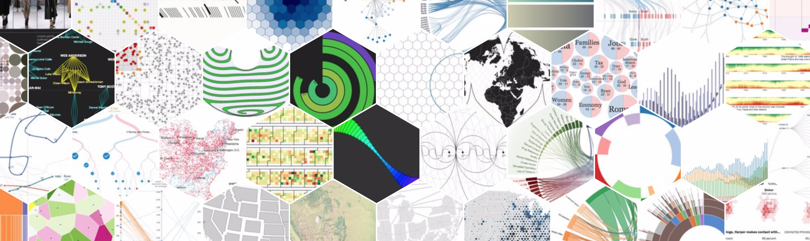
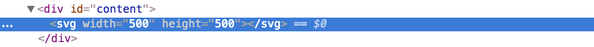
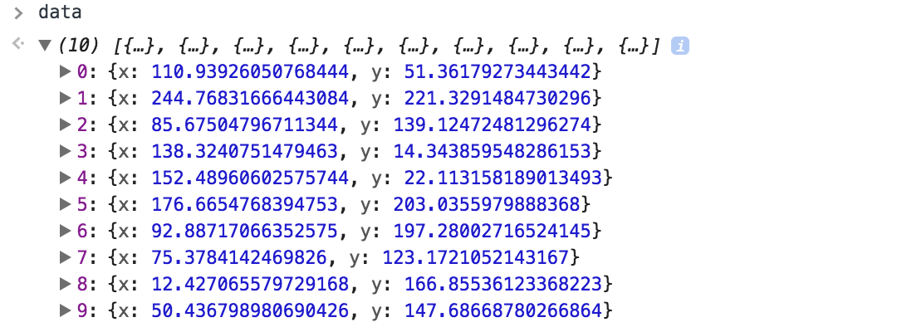
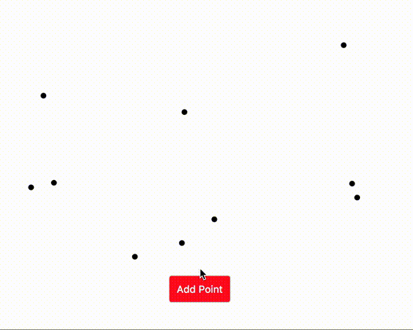
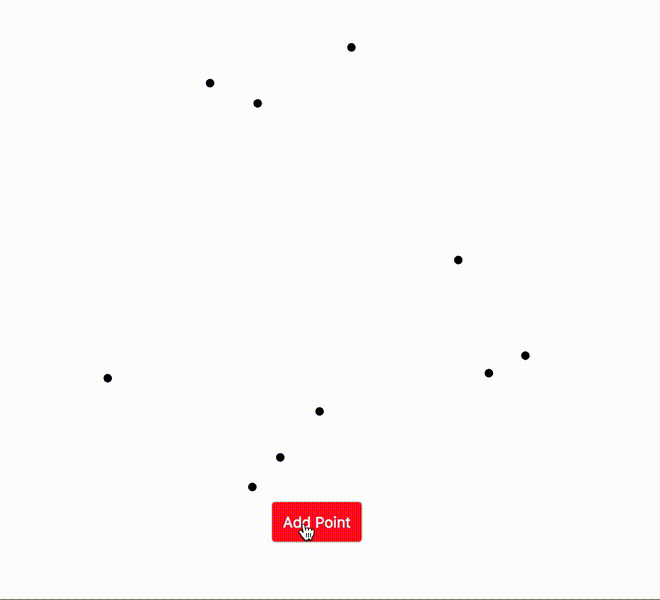

## Working with SVG

D3 is often used to create SVG elements that display data visualizations. The [D3.js homepage](https://d3js.org/) has lots of example visualizations built with D3:



Let's continue practicing data bindings by putting together some sample SVG charts. To do so, let's restore the HTML to a blank canvas:

```html
<!DOCTYPE html>
<html>
  <head>
    <meta charset='UTF-8'>
    <title>Hello There!</title>
    <link href='style.css' rel='stylesheet'>
  </head>
  <body>
    <div id='content'></div>
    <script src='https://cdnjs.cloudflare.com/ajax/libs/d3/4.11.0/d3.min.js'></script>
    <script src='script.js'></script>
  </body>
</html>
```

#### Creating the SVG Tag

Next let's use D3 to add an `SVG` element to the page with a particular height and width:

```
var height = 500;
var width = 500;

var svg = d3.select('#content').append('svg')
    .attr('width', width)
    .attr('height', height)
```

If you run those lines then examine the resulting HTML page, you'll see it contains an `SVG` element with a height attribute set to 500 and a width attribute set to 500:



#### Generating Sample Data

For the present, let's suppose we want to make a scatterplot on the `SVG`. To do so, let's add to `data` 10 [`Objects`](https://developer.mozilla.org/en-US/docs/Web/JavaScript/Guide/Working_with_Objects) with `x` and `y` attributes set to random numbers:

```javascript
var data = [];
for (var i=0; i<10; i++) {
  data.push({
    x: Math.random() * 500,
    y: Math.random() * 500
  })
}
```

If you run that code then type `data` in your developer tools and hit enter, you'll be able to investigate the `data` object:



#### Basic Shapes in SVG

Great! Now we can use the data to add some shapes to the SVG. Here are some **[basic shapes in SVG](https://developer.mozilla.org/en-US/docs/Web/SVG/Element)** and their required attributes:

| Element Tag | Required Attributes |
| --- | --- |
| `<circle>` | **`cx`** x-position, **`cy`** y-position, **`r`** radius |
| `<line>` | **`x1`** x-start, **`x2`** x-end, **`y1`** y-start, **`y2`** y-end |
| `<rect>` | **`x`** x-position, **`y`** y-position, **`width`** width, **`height`** height |

Let's use the **data binding** techniques we covered above to add one circle to the SVG for each item in `data`:

```javascript
var selection = d3.select('svg').selectAll('circle').data(data);

selection.enter()
  .append('circle')
    .attr('cx', function(d) { return d.x; })
    .attr('cy', function(d) { return d.y; })
    .attr('r', 4)
```

If you reload the page, you should see the start of your scatter plot!

## Responding to User Actions

Awesome! Now let's add a button users can click to add a point to the chart:

```
d3.select('body').append('button')
  .text('Add Point')
```

To make the page look a little nicer, let's add a few lines of CSS to the `style.css` file:

```css
svg {
  display: block;
  margin: 0 auto;
}

button {
  padding: 10px;
  background: red;
  color: #fff;
  font-size: 14px;
  display: block;
  margin: 0 auto;
  cursor: pointer;
}
```

Great, now we can add some interactivity to the page. To do so, let's create a function that adds the `circle` elements to the SVG:

```javascript
function render(data) {
  // Create a data binding
  var selection = d3.select('svg').selectAll('circle').data(data);

  // Enter block
  selection.enter()
    .append('circle')
      .attr('cx', function(d) { return d.x; })
      .attr('cy', function(d) { return d.y; })
      .attr('r', 4)
}
```

Then we'll bind an event listener to the button we add to the page. When that button is clicked, we'll add an additional Object with random `x` and `y` attributes to `data`, then we'll call the `render()` function we just defined:

```javascript
// Add a button that lets users add points to `data`
d3.select('body').append('button')
  .text('Add Point')
  .on('click', function() {
    data.push({
      x: Math.random() * 500,
      y: Math.random() * 500
    })
    render(data)
  })
```

Your `script.js` file should now look like this:

```javascript
// Generate 10 observations with random x,y attributes
var data = [];
for (var i=0; i<10; i++) {
  data.push({
    x: Math.random() * 500,
    y: Math.random() * 500
  })
}

// Add a button that lets users add points to `data`
d3.select('body').append('button')
  .text('Add Point')
  .on('click', function() {
    data.push({
      x: Math.random() * 500,
      y: Math.random() * 500
    })
    render(data)
  })

// Specify the Chart Attributes
var height = 500;
var width = 500;

// Create the SVG
var svg = d3.select('#content').append('svg')
  .attr('width', width)
  .attr('height', height)

// Create data binding and run updates
function render(data) {
  var selection = d3.select('svg').selectAll('circle').data(data);

  // Enter block
  selection.enter()
    .append('circle')
      .attr('cx', function(d) { return d.x; })
      .attr('cy', function(d) { return d.y; })
      .attr('r', 4)
}

render(data)
```

If you refresh the page and click the button a few times, you should see some new points appear!



## Animating Transitions

One of the most impressive features of D3 are the animation features. To get a taste of these animation features, let's add the `.transition()` and `.exit()` blocks to the `render()` function:

```javascript
function render(data) {
  var selection = d3.select('svg').selectAll('circle').data(data);

  // Enter block
  selection.enter()
    .append('circle')
      .attr('cx', function(d) { return d.x; })
      .attr('cy', function(d) { return d.y; })
      .attr('r', 4)

  // Transition block
  selection.transition()
    .duration(1000)
    .attr('cx', function(d) { return d.x; })
    .attr('cy', function(d) { return d.y; })

  // Exit block
  selection.exit()
    .remove()
}
```

Next, let's update the block that adds the button to the page. Previously when users clicked the button, we used the `.push()` method to add a new Object to the end of `data`. Let's instead use `.unshift()` to add a new Object to the start of `data`:

```
// Add a button that lets users add points to `data`
d3.select('body').append('button')
  .text('Add Point')
  .on('click', function() {
    data.unshift({
      x: Math.random() * 500,
      y: Math.random() * 500
    })
    render(data)
  })
```

Your full `script.js` code should look like the following:

```javascript
// Generate 10 observations with random x,y attributes
var data = [];
for (var i=0; i<10; i++) {
  data.push({
    x: Math.random() * 500,
    y: Math.random() * 500
  })
}

// Add a button that lets users add points to `data`
d3.select('body').append('button')
  .text('Add Point')
  .on('click', function() {
    data.unshift({
      x: Math.random() * 500,
      y: Math.random() * 500
    })
    render(data)
  })

// Specify the Chart Attributes
var height = 500;
var width = 500;

// Create the SVG
var svg = d3.select('#content').append('svg')
  .attr('width', width)
  .attr('height', height)

// Create data binding and run updates
function render(data) {
  var selection = d3.select('svg').selectAll('circle').data(data);

  // Enter block
  selection.enter()
    .append('circle')
      .attr('cx', function(d) { return d.x; })
      .attr('cy', function(d) { return d.y; })
      .attr('r', 4)

  // Transition block
  selection.transition()
    .duration(1000)
    .attr('cx', function(d) { return d.x; })
    .attr('cy', function(d) { return d.y; })

  // Exit block
  selection.exit()
    .remove()
}

render(data)
```

If you refresh the page and click the button a few times, you'll see your points transitioning! As you can see, by simply implementing a data binding, changing the data, and using the `.enter()`, `.transition()`, and `.exit()` blocks, we get smooth transitions between the data states!



# Next Steps

Great work! Next [let's build a proper chart with D3](https://github.com/YaleDHLab/lab-workshops/blob/master/intro-to-d3/lets-make-a-chart.md).