# Build a Chart with ggplot2

The following will give you a very brief introduction to ggplot2. We'll cover installation, sample data creation, and some sample visualizations.

## Installing ggplot2

To get started with ggplot2, we'll first need to install the library. We can do so by opening RStudio and running the following lines:

```
if(!require(ggplot2)) install.packages('ggplot2')
```

## Loading data

Once ggplot2 is installed, you can load a sample dataset with the following lines:

```
# load the ggplot2 library
library(ggplot2)

# load the mpg dataframe (which comes with ggplot2) into a df object
df <- mpg
```

Once the `df` object is created, you can inspect it by running: 

```
View(df)
```

Viewing the mpg dataframe in this way will give you a sense of the different variable types in the data set.

To write a dataframe to disk or read a dataframe from disk, one can use the following approach:

```
# write the mpg dataframe to disk
write.table(df, file='mpg.tsv', quote=FALSE, sep='\t', col.names = TRUE)

# read the mpg dataframe from disk
df2 <- read.table('mpg.tsv', quote='', sep='\t', fill=NA)

# validate that the read dataframe is identical to the original mpg dataframe
all(df == df2)
```

## Understanding ggplot2

As others have written, "ggplot2 is based on the Grammar of Graphics, the idea that you can build every graph from the same few components: a <b>data</b> set, a set of <b>geoms</b>--visual marks that represent data points--and a <b>coordinate system</b>":

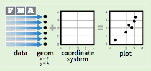

To display data values, one must map variables in a data set to aesthetic properties of the geom, like <b>size</b>, <b>color</b>, and <b>x</b> and <b>y</b> locations:

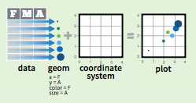

## Getting started with ggplot2

ggplot allows you to specify these features very easily. The basic structure of a ggplot chart is:


```
ggplot( DATAFRAME.HERE, aes( x=XAXIS.VARIABLE.HERE, y=YAXIS.VARIABLE.HERE ) ) +
  GEOM_HERE()
```
#### Scatterplots

For example, using the [mpg dataset](http://ggplot2.tidyverse.org/reference/mpg.html), we can visualize the relationship between miles per gallon on the highway (`hwy`) and miles per gallon in the city (`cty`) among a series of cars with the following lines: 

```
ggplot(mpg, aes(x=hwy, y=cty)) +
  geom_point()
```
Those lines produce the following plot:

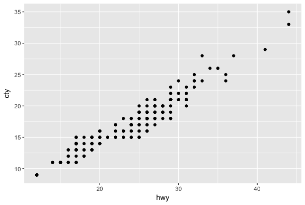

Congratulations, you've just made a ggplot chart!

#### Adding layers

In ggplot, we can add new features to charts by simply concatenating the desired layer to our chart object. The general form of this addition is:

```
ggplot( DATAFRAME.HERE, aes( x=XAXIS.VARIABLE.HERE, y=YAXIS.VARIABLE.HERE ) ) +
  GEOM_HERE() +
  NEW_LAYER_HERE()
```

For example, we could add a regression line to the plot above by simply adding a new layer to the chart:

```
ggplot(mpg, aes(x=hwy, y=cty)) +
  geom_point() +

  # add a loess regression line
  geom_smooth()
```
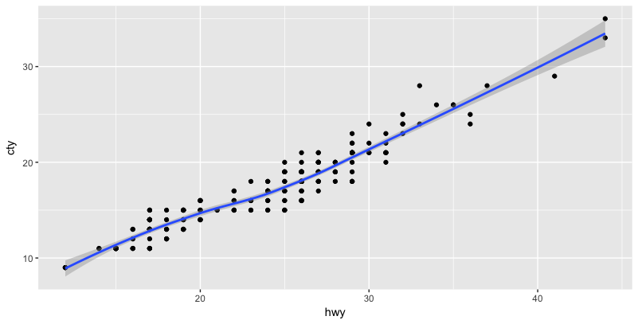

If you needed a first degree polynomial fit instead of loess, you could add that layer instead:

```
# define a first degree polynomial equation
first.degree.polynomial <- y ~ poly(x, 1, raw = TRUE)
  
ggplot(mpg, aes(x=hwy, y=cty)) +
  geom_point() +

  # add the linear fit
  geom_smooth(method = "lm", se = FALSE,
              formula = first.degree.polynomial, 
              colour = "red")
```
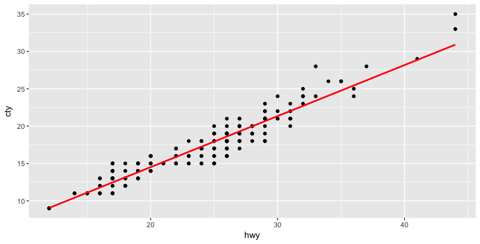

#### Using categorical axes

Alternatively, we could plot each `manufacturer`'s miles per gallon on the highway (`hwy`) values with the following:

```
ggplot(mpg, aes(x=manufacturer, y=cty)) +
  geom_point()
```

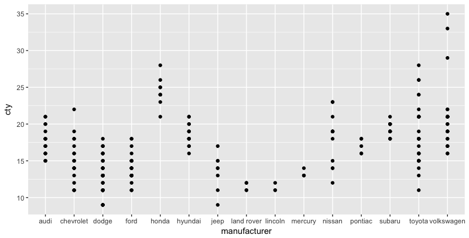

If we wanted to display the mean mpg in the highway for each manufacturer, we could reshape our dataframe, then create a new plot:

```
mean.by.manufacturer <- aggregate( hwy ~ manufacturer, mean, data=mpg )

ggplot(mean.by.manufacturer, aes(x=manufacturer, y=hwy)) +
  geom_point()
```

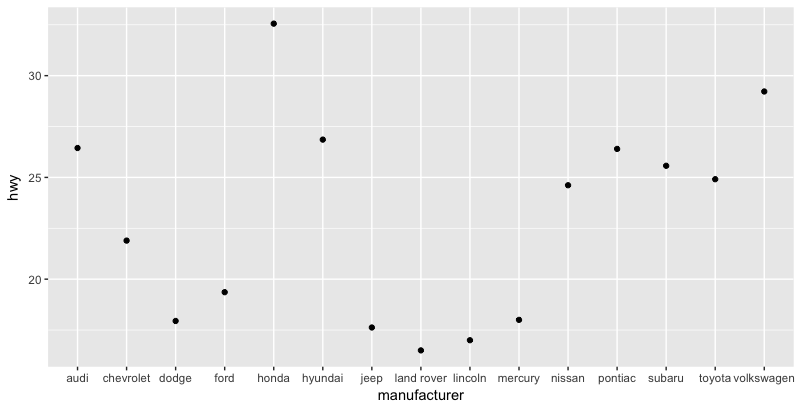

#### Barcharts

Those points are hard to see, so it might make more sense to represent this data as a bar chart:

```
ggplot(mean.by.manufacturer, aes(x=manufacturer, y=hwy)) +
  geom_bar(stat='identity')
```
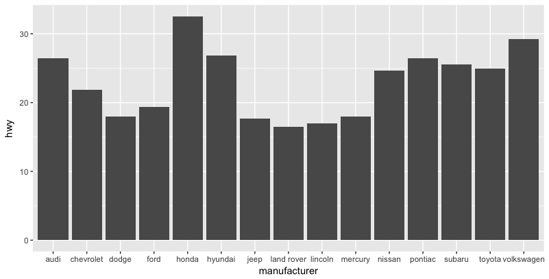

If we wanted to reorder the xaxis by the mean highway mpg of each manufacturer, one could use the following lines:

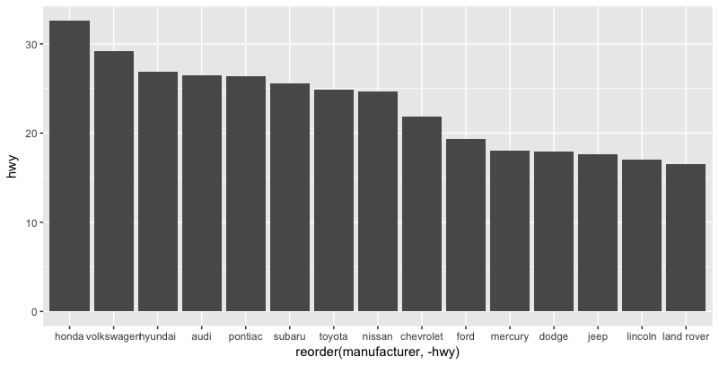

#### Labels

That last chart has a pretty clumsy x-axis label, and all of the charts above lack any chart label. Let's fix these problems by adding some labels:

```
ggplot(mean.by.manufacturer, aes(x=reorder(manufacturer, -hwy), y=hwy)) +
  geom_bar(stat='identity') +
  xlab('Manufacturer') +                  # add an x-axis label
  ylab('Average Highway MPG') +           # add an y-axis label
  ggtitle('Highway MPG by Manufacturer')  # add a chart title
```

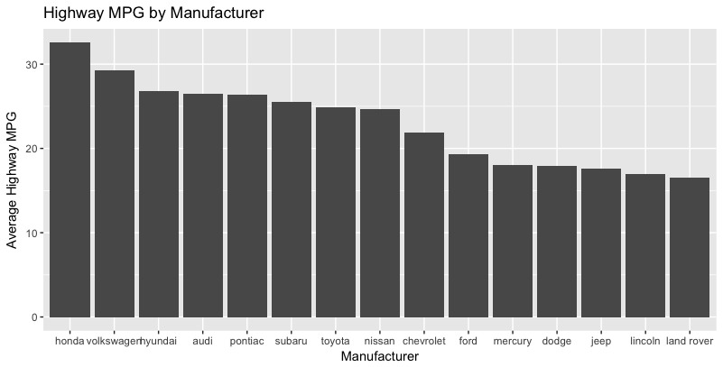

## Going further with ggplot

You now have a sense of the basic chart structure. From here, you can move on to a broader sense of the various layers available in ggplot. The following [documents](./images/ggplot2-cheatsheet.pdf) offer a phenomenal guide to those features (click to enlarge). Alternatively, continue on to the [ggplot feature deep dive](./chart-features.md) for a more thorough treatment of the various geoms and features in ggplot:

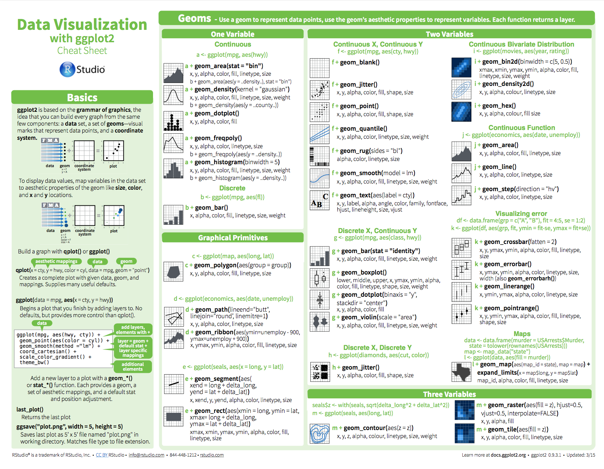
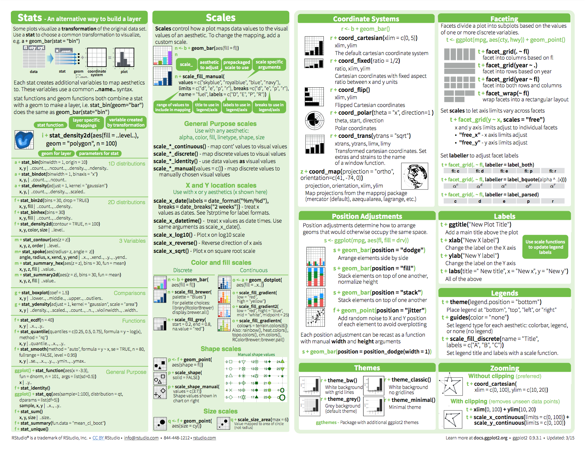