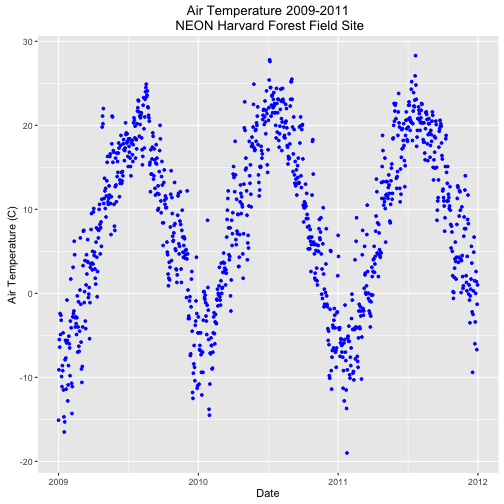
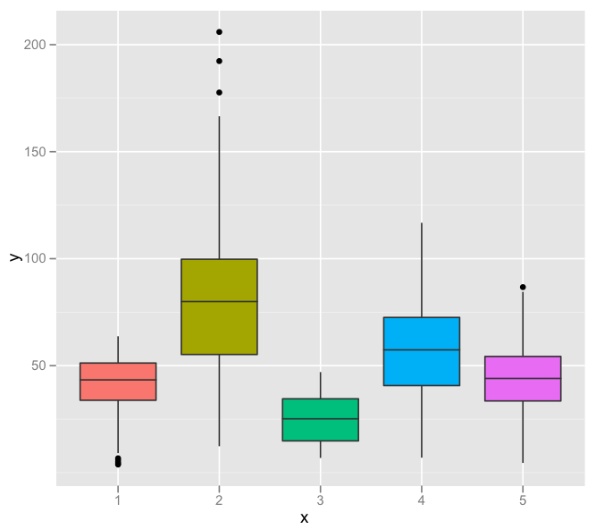
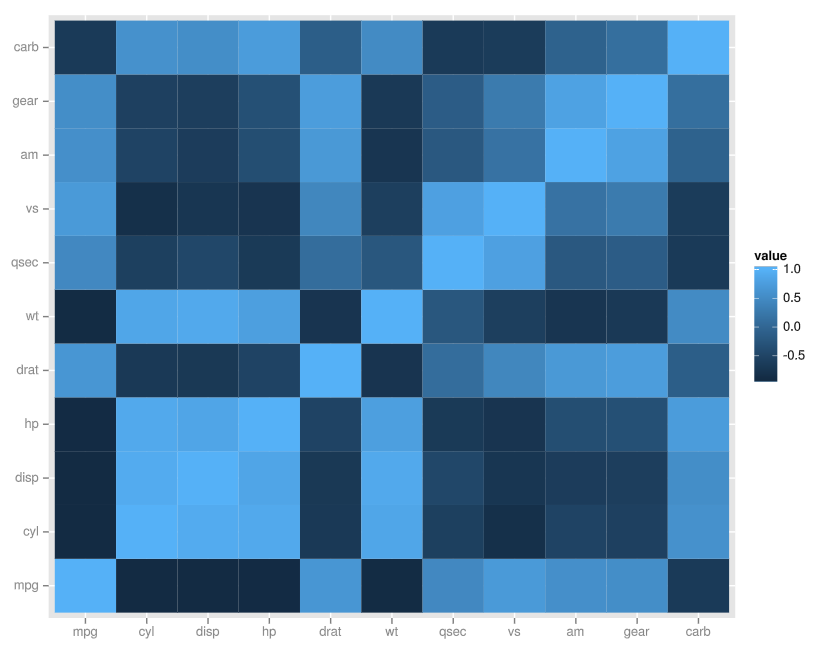
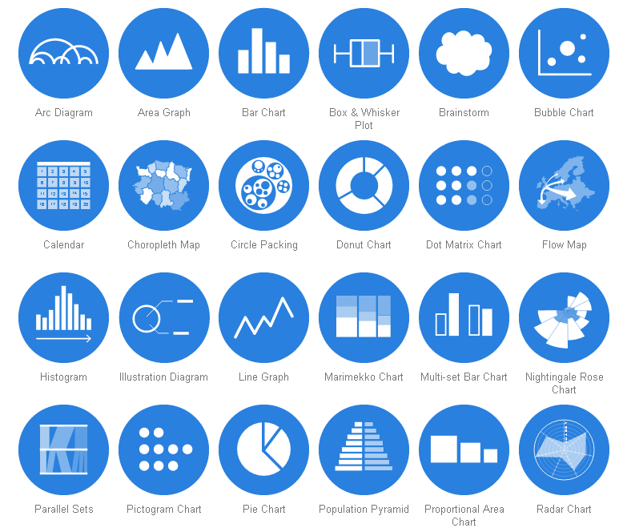
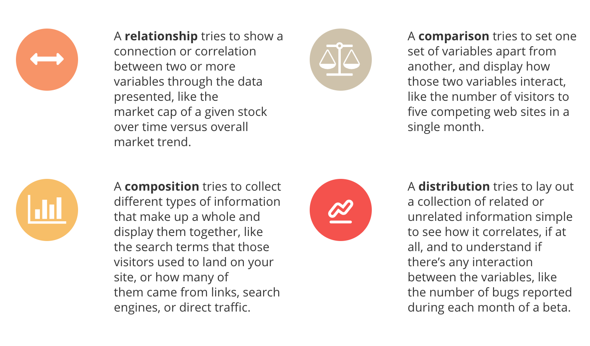
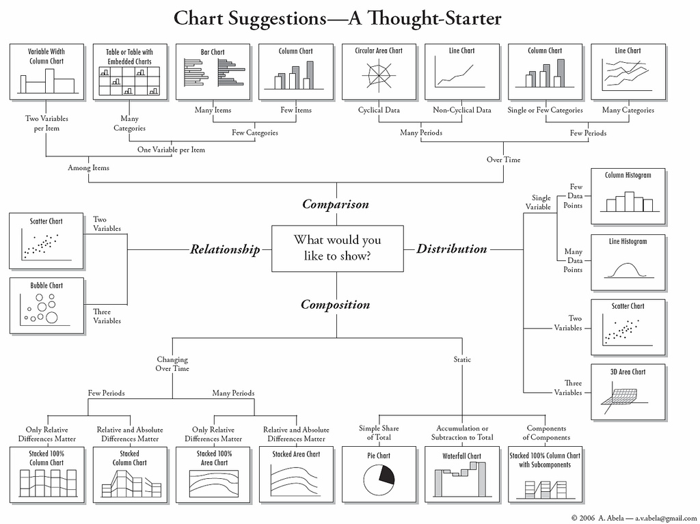

# Chart Design

In order to create a chart with ggplot2, you'll need to spend some time thinking about chart design. Chart design involves identifying the types of scales appropriate for your data types, and then selecting a data visualization strategy based on those scales.

This overview gives a quick introduction to relevant data types and then moves on to a discussion of data visualization strategies appropriate to different situations.

## Data types

Very often the types of variables in your dataset determine the kind of visualization that's appropriate for the dataset. To begin brainstorming the visualization strategy that's appropriate for your task, it's helpful to divide variables into the following two types:

| Data Type     | Definition           | Examples |
| ------------- |:-------------:       | -----:|
| continuous    | Any two observations on a continuous scale have an <b>infinite</b> number of observations between them | linear scales, log scales |
| discrete      | Any two observations on a discrete scale have a <b>finite</b> number of observations between them | ['a', 'b', 'c'] |

In order to identify the scales that are appropriate for the x and y axes in a chart, you must determine whether the variable to be displayed on that scale is continuous or discrete. The following examples are meant as visual examples of the two data types discussed above:

#### Sample Scatterplot

| Axis   | Data Type |      
| ------ |:--------: | 
| x-axis | continous |
| y-axis | continous |

#### Sample Boxplot

| Axis   | Data Type |      
| ------ |:--------: | 
| x-axis | discrete  |
| y-axis | continous |

#### Sample Heatmap

| Axis   | Data Type |      
| ------ |:--------: | 
| x-axis | discrete  |
| y-axis | discrete  |

## Chart types

There are many kinds of charts. The following represent only a small handful of options:

Different charts are appropriate for different situations. To determine the kind of chart that is appropriate for a given situation, it's helpful to consider the kind of argument you want to make with your data. Sometimes you may want to visualize the <i>relationship</i> between variables (e.g. their correlation). Other times you may wish to highlight the differences between variables with a <i>comparison</i>. Sometimes you just need to show lots of different aspects of your data in a <i>composition</i>, while othertimes you want to show some <i>distribution</i> within a data set:

Once you know which of these four kinds of visualization you want to create, you can use the following diagram to select a strategy for your visualization (click to enlarge):

## Building a basic chart

Once you can differentiate between discrete and continuous axes, you're ready to [start building charts](./build-a-chart.md).
