# Chart Features in ggplot2

Once you've established a basic chart, you'll often want to adjust aspects of the chart such as labels, geoms, etc. The following guide is meant as a brief overview of some of the chart features users often want to adjust.

#### Basics tasks
* [Basic plot setup](#basic-plot-setup)
* [Scatterplot](#scatterplot)
* [Consistent point styling](#consistent-point-styling)
* [Variegated point styling](#variegated-point-styling)
* [Add title and labels](#add-title-and-labels)
* [Change text color](#change-text-color)
* [Adjust labels](#adjust-labels)
* [Change text fonts](#change-text-fonts)
* [Change point color](#change-point-color)
* [Adjust axis limits](#adjust-axis-limits)
* [Change axis labels](#change-axis-labels)
* [Rotate axis text](#rotate-axis-text)
* [Flip X and Y axis](#flip-x-and-y-axis)
* [Grid lines and panel background](#grid-lines-and-panel-background)
* [Plot margin and background](#plot-margin-and-background)
* [Colors](#colors)

#### Legend
* [Hide legend](#hide-legend)
* [Change legend title](#change-legend-title)
* [Change legend and point color](#change-legend-and-point-color)
* [Change legend position](#change-legend-position)
* [Change order of legend items](#change-order-of-legend-items)
* [Change legend title text box or symbol](#change-legend-title-text-box-or-symbol)

#### Plot text and annotation
* [Add text in chart](#add-text-in-chart)
* [Annotation](#annotation)

#### Multiple plots
* [Multiple chart panels](#multiple-chart-panels)
* [Free X and Y axis scales](#free-x-and-y-axis-scales)
* [Arrange multiple plots](#arrange-multiple-plots)

#### Different Geoms
* [Add smoothing line](#add-smoothing-line)
* [Add horizontal or vertical line](#add-horizontal-or-vertical-line)
* [Add bar chart](#add-bar-chart)
* [Distinct color for bars](#distinct-color-for-bars)
* [Change color and width of bars](#change-color-and-width-of-bars)
* [Change color palette](#change-color-palette)
* [Line chart](#line-chart)
* [Line chart from timeseries](#line-chart-from-timeseries)
* [Ribbons](#ribbons)
* [Area](#area)
* [Boxplot and Violin](#boxplot-and-violin)
* [Density](#density)
* [Tiles](#tiles)

## Basic tasks

#### Basic plot setup

```{r, eval=FALSE}
gg <- ggplot(df, aes(x=xcol, y=ycol)) 
```

`df` must be a dataframe that contains all information to make the ggplot. Plot will show up only after adding the geom layers.

#### Scatterplot

```{r, eval=FALSE}
library(ggplot2)
gg <- ggplot(diamonds, aes(x=carat, y=price)) 
gg + geom_point()
```

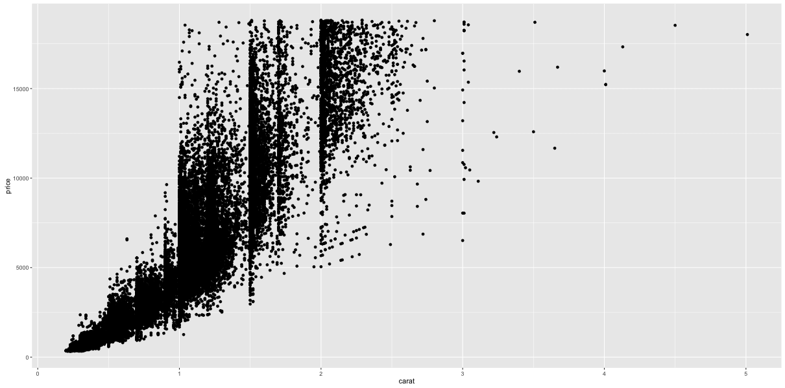

#### Consistent point styling

```{r, eval=FALSE}
# 'stroke' controls the thickness of point boundary
gg + geom_point(size=1, shape=1, color="steelblue", stroke=2)
```

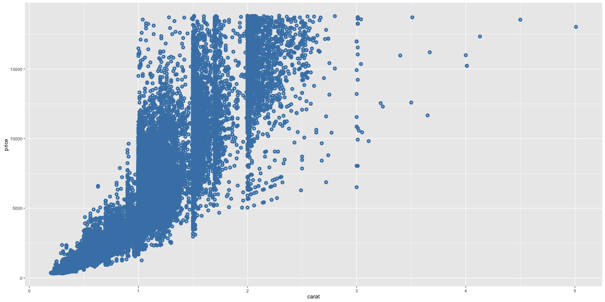

#### Variegated point styling

Make the aesthetics vary based on a variable in `df`.
```{r, eval=FALSE}    
# carat, cut and color are variables in `diamonds`
gg + geom_point(aes(size=carat, shape=cut, color=color, stroke=carat))  
```

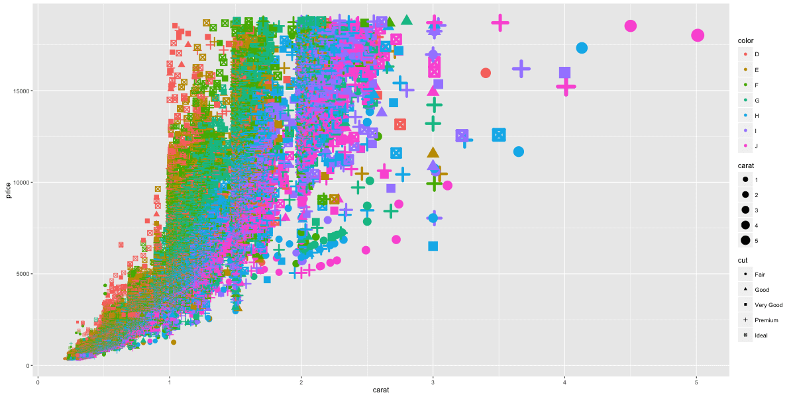

#### Add Title and labels

```{r, eval=FALSE}    
gg1 <- gg + geom_point(aes(color=color))

# ggtitle("title") also changes the title.
gg2 <- gg1 + labs(title="Diamonds", x="Carat", y="Price")
print(gg2)
```

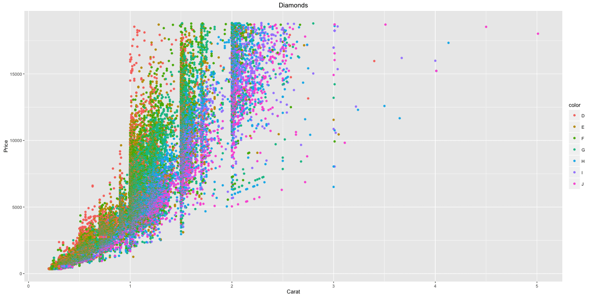

#### Change text color

```{r, eval=FALSE}  
# all text turns blue.
gg2 + theme(text=element_text(color="blue"))
```


#### Adjust labels

```
plot.title: Controls plot title.
axis.title.x: Controls X axis title
axis.title.y: Controls Y axis title
axis.text.x: Controls X axis text
axis.text.y: Controls y axis text
```

```{r, eval=FALSE}
gg3 <- gg2 + theme(plot.title=element_text(size=25),
                   axis.title.x=element_text(size=20),
                   axis.title.y=element_text(size=20),
                   axis.text.x=element_text(size=15),
                   axis.text.y=element_text(size=15))
print(gg3)
```

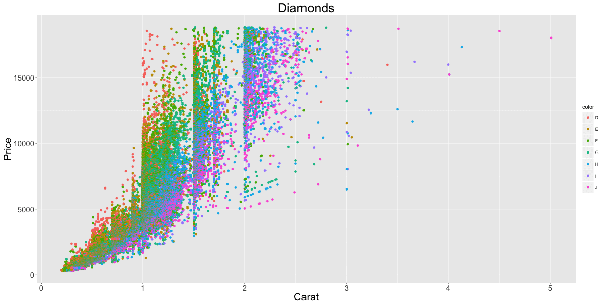

#### Change text fonts

```{r, eval=FALSE}
gg3 + labs(title="Plot Title\nSecond Line of Plot Title") +
  theme( plot.title=element_text(face="bold",
                                 color="steelblue",
                                 lineheight=1.2) )
```

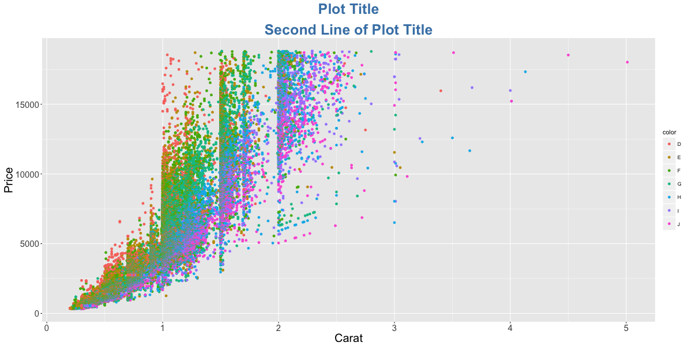

#### Change point color
```{r, eval=FALSE}  
gg3 + scale_colour_manual(name='Legend',
                          values=c('D'='grey', 
                                   'E'='red', 
                                   'F'='blue', 
                                   'G'='yellow', 
                                   'H'='black', 
                                   'I'='green', 
                                   'J'='firebrick'))
```


#### Adjust axis limits

Method 1: Zoom in
```{r, eval=FALSE}
# zoom in
gg3 + coord_cartesian(xlim=c(0,3), ylim=c(0, 5000)) + 
  geom_smooth()
```

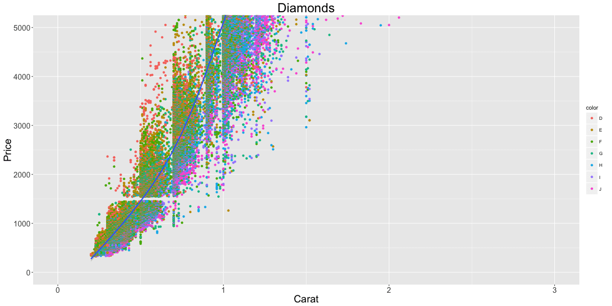

Method 2: Hides the points outside limits
```{r, eval=FALSE}
# hides the points 
gg3 + xlim(c(0,3)) + ylim(c(0, 5000)) + geom_smooth()  
```    
  
Method 3: Hides the points outside limits
```{r, eval=FALSE}
# hides the points outside limits
gg3 + scale_x_continuous(limits=c(0,3)) + 
  scale_y_continuous(limits=c(0, 5000)) + 
  geom_smooth() 
```


Notice the change in smoothing line because of the hidden points. This could sometimes be misleading in your analysis.

#### Change axis labels
```{r, eval=FALSE}
# if Y is continuous, if X is a factor
labels <- c("zero","one", "two", "three", "four", "five")
gg3 + scale_x_continuous(labels=labels) +
  scale_y_continuous(breaks=seq(0, 20000, 4000))
```

Use `scale_x_discrete` instead, if X variable is a factor.

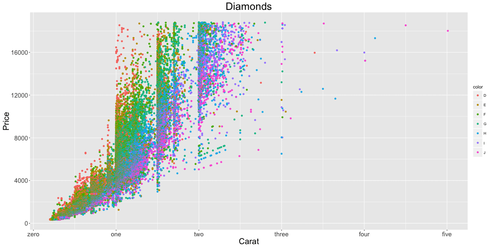

#### Rotate axis text

```{r, eval=FALSE}
gg3 + theme(axis.text.x=element_text(angle=45), axis.text.y=element_text(angle=45))
```

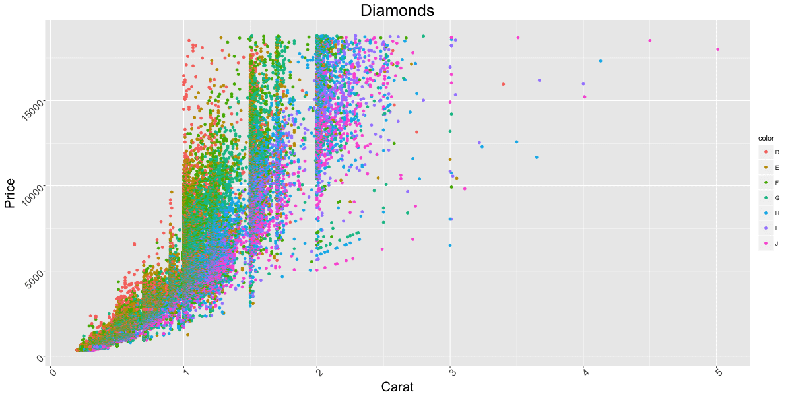

#### Flip X and Y Axis
```{r, eval=FALSE}
gg3 + coord_flip()  # flips X and Y axis.
```

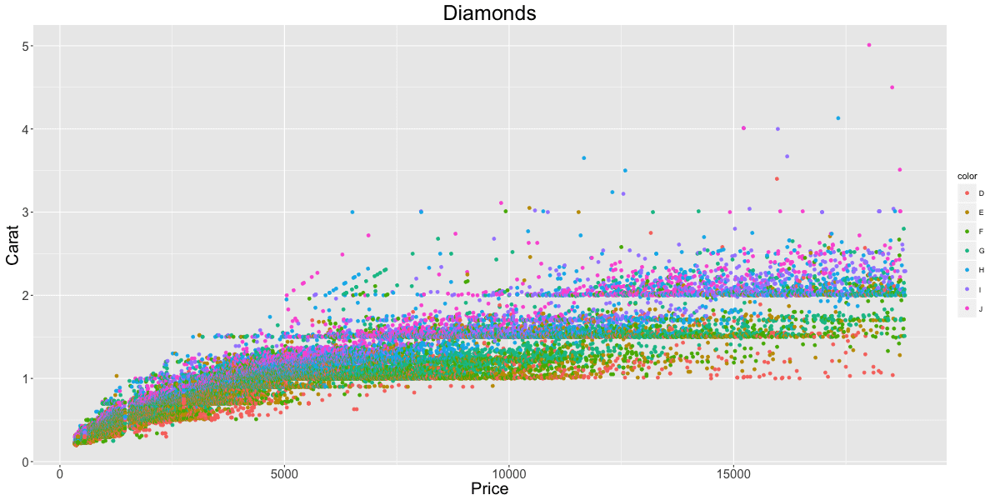

#### Grid lines and panel background
```{r, eval=FALSE}
gg3 + theme(panel.background = element_rect(fill = 'springgreen'),
  panel.grid.major = element_line(colour = "firebrick", size=3),
  panel.grid.minor = element_line(colour = "blue", size=1))
```

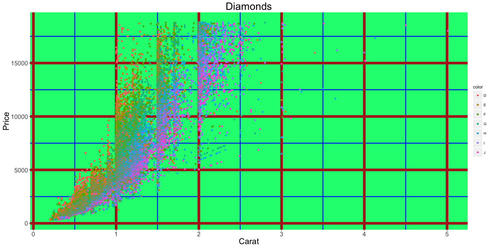

#### Plot margin and background
```{r, eval=FALSE}
# top, right, bottom, left
gg3 + theme(plot.background=element_rect(fill="yellowgreen"),
            plot.margin = unit(c(2, 4, 1, 3), "cm"))
```

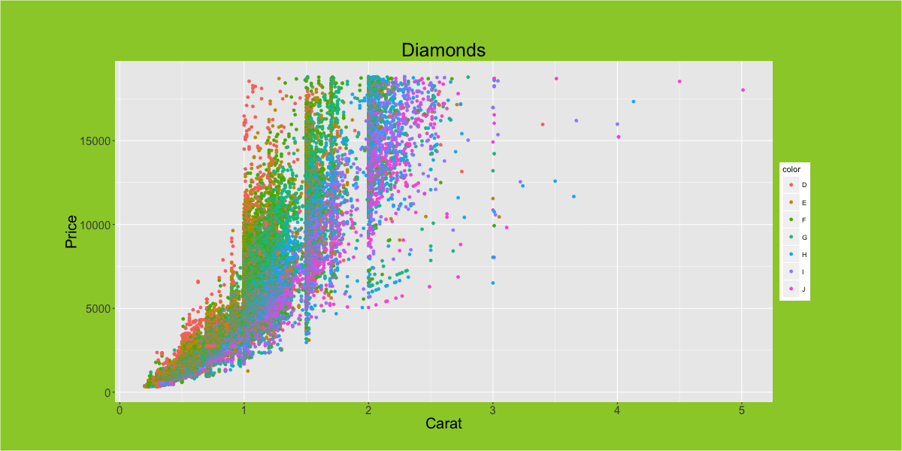

#### Colors

The whole list of colors are displayed at your R console in the `color()` function. Here are few of my suggestions for nice looking colors and backgrounds:

* steelblue  (points and lines)
* firebrick (point and lines)
* springgreen (fills)
* violetred (fills)
* tomato (fills)
* skyblue (bg)
* sienna (points, lines)
* slateblue (fills)
* seagreen (points, lines, fills)
* sandybrown (fills)
* salmon (fills)
* saddlebrown (lines)
* royalblue (fills)
* orangered (point, lines, fills)
* olivedrab (points, lines, fills)
* midnightblue (lines)
* mediumvioletred (points, lines, fills)
* maroon (points, lines, fills)
* limegreen (fills)
* lawngreen (fills)
* forestgreen (lines, fills)
* dodgerblue (fills, bg)
* dimgray (grids, secondary bg)
* deeppink (fills)
* darkred (lines, points)

If you are looking for consistent colors, the `RColorBrewer` package has predefined color palettes.

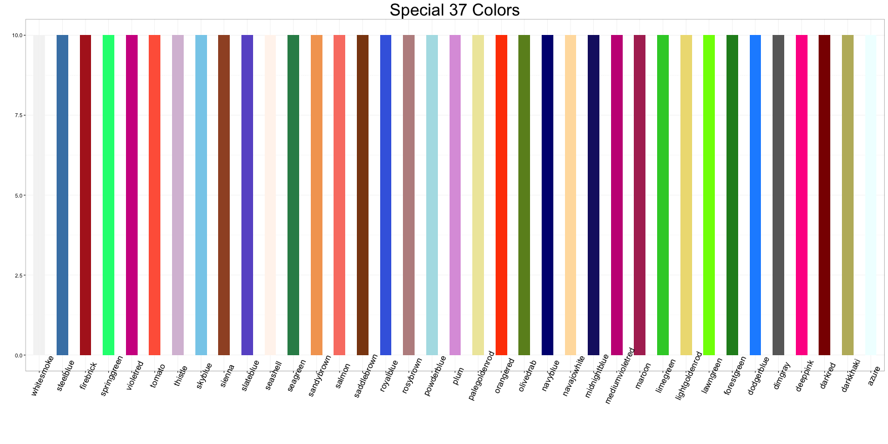

```{r, eval=FALSE, echo=FALSE}
colors <- c("whitesmoke", "steelblue", "firebrick", "springgreen", "violetred",
            "tomato", "thistle", "skyblue", "sienna", "slateblue",
            "seashell", "seagreen", "sandybrown", "salmon", "saddlebrown",
            "royalblue", "rosybrown", "powderblue", "plum", "palegoldenrod",
            "orangered", "olivedrab", "navyblue", "navajowhite", "midnightblue",
            "mediumvioletred", "maroon", "limegreen", "lightgoldenrod", "lawngreen",
            "forestgreen", "dodgerblue", "dimgray", "deeppink", "darkred",
            "darkkhaki", "azure")

df <- data.frame(num=rep(10, 37), cols=factor(colors, ordered=T))

gg_bar <- ggplot(df, aes(x=cols, y=num)) +
  geom_bar(stat = "identity", width = 0.5, fill=df$cols) + 
  theme_bw() + 
  theme(axis.text.x=element_text(angle=65, size=15),
        plot.title=element_text(size=30)) + 
  scale_x_discrete(labels=df$cols) + 
  labs(title="Special 37 Colors", x="", y="")

print(gg_bar)
```

## Legend

#### Hide legend
```{r, eval=FALSE}  
gg3 + theme(legend.position="none")  # hides the legend
```

#### Change legend title
```{r, eval=FALSE}  
# Remove legend title (method 1)
gg3 + scale_color_discrete(name="")

# Remove legend title (method 2)
p1 <- gg3 + theme(legend.title=element_blank())

# Change legend title
p2 <- gg3 + scale_color_discrete(name="Diamonds")

# arrange the plots
library(gridExtra)
grid.arrange(p1, p2, ncol=2)  
```

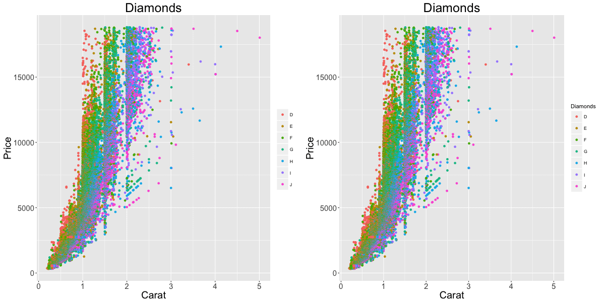

#### Change legend and point color
```{r, eval=FALSE}  
gg3 + scale_colour_manual(name='Legend',
                          values=c('D'='grey',
                                   'E'='red',
                                   'F'='blue',
                                   'G'='yellow',
                                   'H'='black',
                                   'I'='green',
                                   'J'='firebrick'))
```

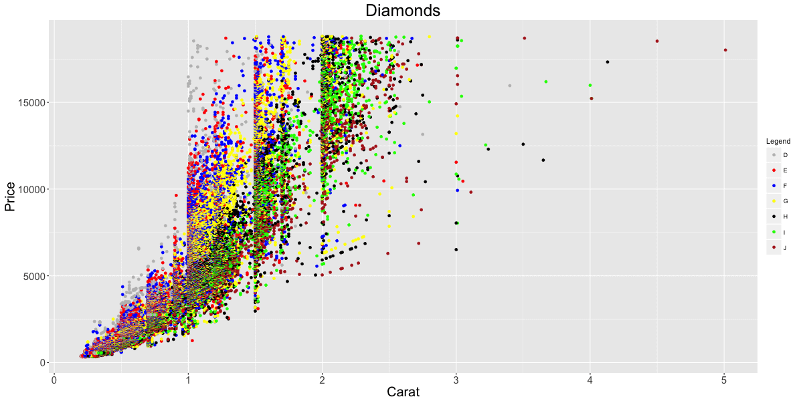

#### Change legend position
__Outside plot__
```{r, eval=FALSE}

# top / bottom / left / right
p1 <- gg3 + theme(legend.position="top")
```    

__Inside plot__
```{r, eval=FALSE}
# legend justification is the anchor point on the legend, considering the bottom left of legend as (0,0)
p2 <- gg3 + theme(legend.justification=c(1,0), legend.position=c(1,0))
gridExtra::grid.arrange(p1, p2, ncol=2)
```

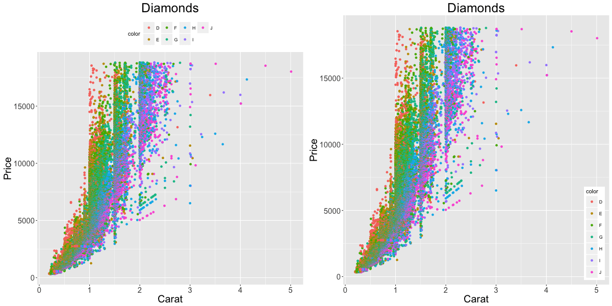

#### Change order of legend items
```{r, eval=FALSE}
df$newLegendColumn <- factor(df$legendcolumn,
                             levels=c(new_order_of_legend_items),
                             ordered = TRUE)
```
Create a new factor variable used in the legend, ordered as you need. Then use this variable instead in the plot.

#### Change legend title text box or symbol
* `legend.title` - Change legend title
* `legend.text` - Change legend text
* `legend.key` - Change legend box
* `guides` - Change legend symbols

```{r, eval=FALSE}  
# legend title color and size, box color, symbol color, size and shape.
gg3 + theme(legend.title = element_text(size=20, color = "firebrick"),
            legend.text = element_text(size=15),
            legend.key=element_rect(fill='steelblue')) + 
  guides(colour = guide_legend(override.aes = list(size=2,
                                                   shape=4,
                                                   stroke=2)))
```

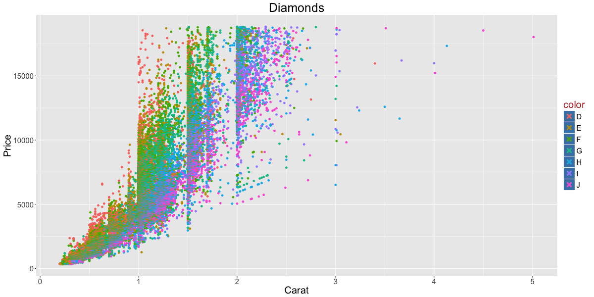

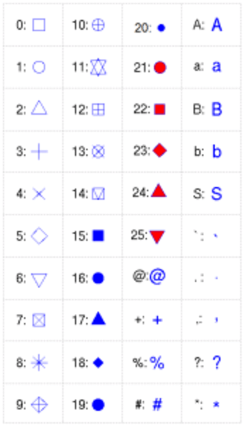

## Plot text and annotation

#### Add text in chart
```{r, eval=FALSE}
gg + geom_text(aes(label=color, color=color), size=4) 
```

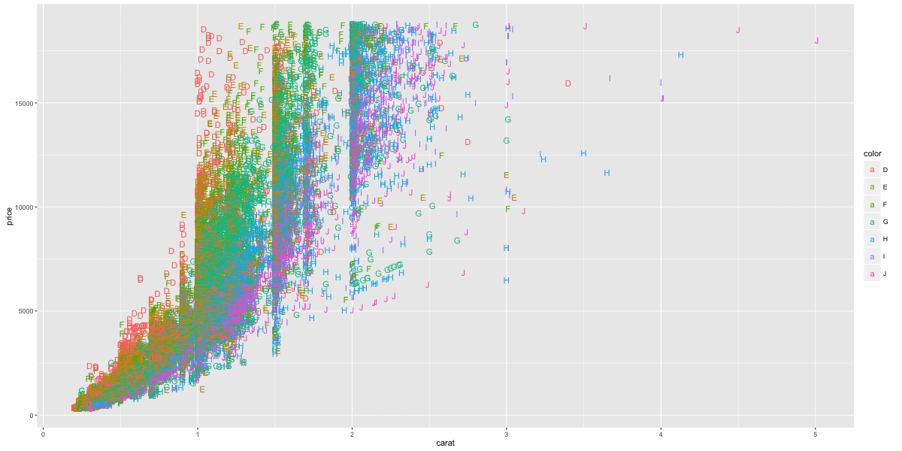

#### Annotation
```{r, eval=FALSE}
library(grid)
my_grob = grobTree(textGrob("My Custom Text",
                            x=0.8,
                            y=0.2,
                            gp=gpar(col="firebrick", fontsize=25, fontface="bold")))
gg3 + annotation_custom(my_grob)
```

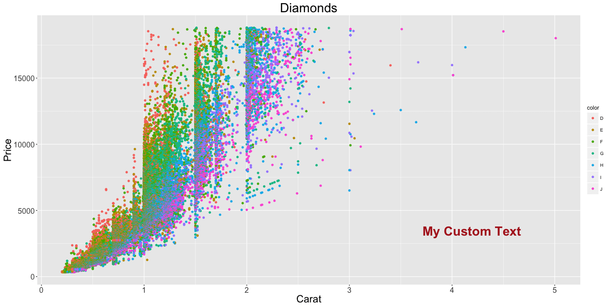

## Multiple plots

#### Multiple chart panels
```{r, eval=FALSE}  

# arrange in a grid. More space for plots.
p1 <- gg1 + facet_grid(color ~ cut)
```

#### Free X and Y axis scales

By setting `scales='free'`, the scales of both X and Y axis is freed. Use `scales='free_x'` to free only X-axis and `scales='free_y'` to free only Y-axis.

```{r, eval=FALSE}  
# free the x and y axis scales.
p2 <- gg1 + facet_wrap(color ~ cut, scales="free")
```

#### Arrange multiple plots
```{r, eval=FALSE}    
library(gridExtra)
grid.arrange(p1, p2, ncol=2)
```

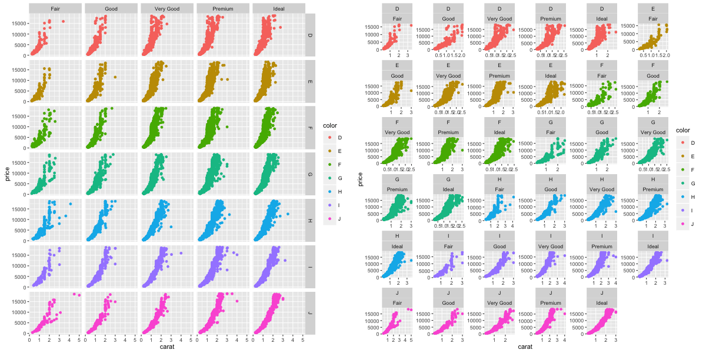

## Different Geoms

#### Add smoothing line
```{r, eval=FALSE}
# method could be - 'lm', 'loess', 'gam'
gg3 + geom_smooth(aes(color=color))
```

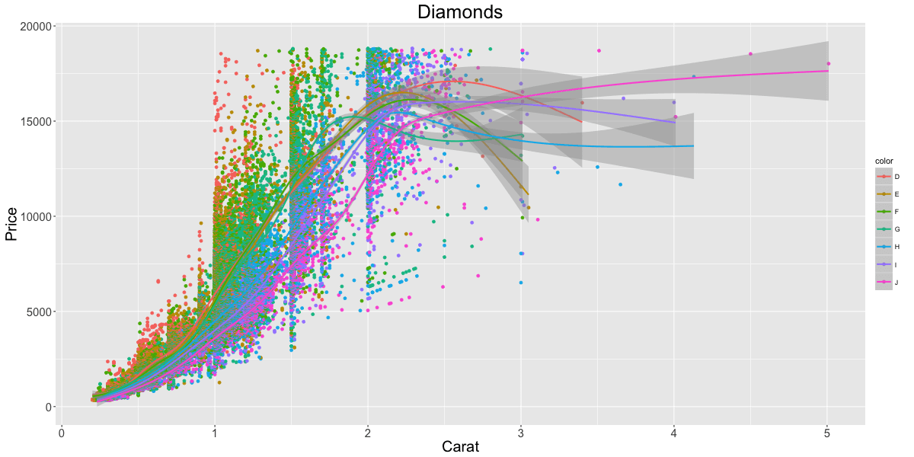

#### Add horizontal or vertical line
```{r, eval=FALSE}
# linetypes: solid, dashed, dotted, dotdash, longdash and twodash
p1 <- gg3 + geom_hline(yintercept=5000, size=2, linetype="dotted", color="blue")
p2 <- gg3 + geom_vline(xintercept=4, size=2, color="firebrick")
p3 <- gg3 + geom_segment(aes(x=4, y=5000, xend=4, yend=10000, size=2, lineend="round"))
p4 <- gg3 + geom_segment(aes(x=carat,
                             y=price,
                             xend=carat,
                             yend=price-500,
                             color=color),
                         size=2) +
  coord_cartesian(xlim=c(3, 5))
gridExtra::grid.arrange(p1,p2,p3,p4, ncol=2)
```

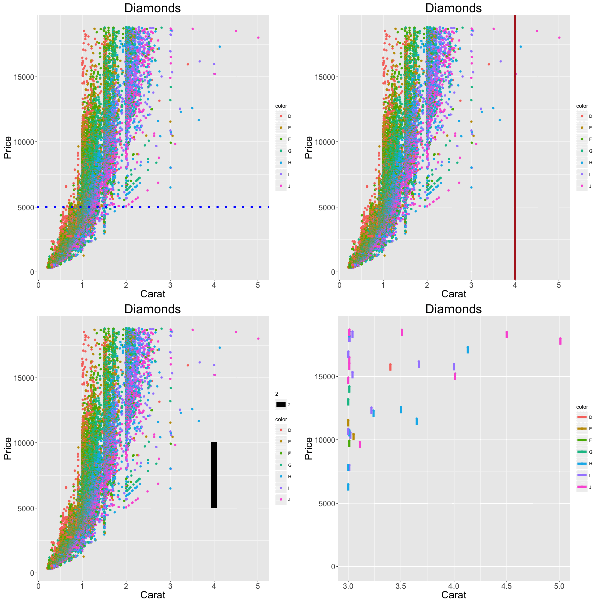

#### Add bar chart
```{r, eval=FALSE}
# Frequency bar chart: Specify only X axis.
gg <- ggplot(mtcars, aes(x=cyl))
gg + geom_bar()  # frequency table
```

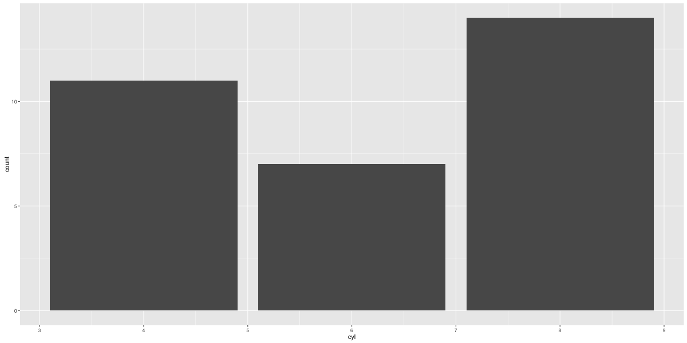

```{r, eval=FALSE}
# side-by-side
gg <- ggplot(mtcars, aes(x=cyl))
p1 <- gg + geom_bar(position="dodge", aes(fill=factor(vs)))

# stacked
p2 <- gg + geom_bar(aes(fill=factor(vs)))
gridExtra::grid.arrange(p1, p2, ncol=2)
```

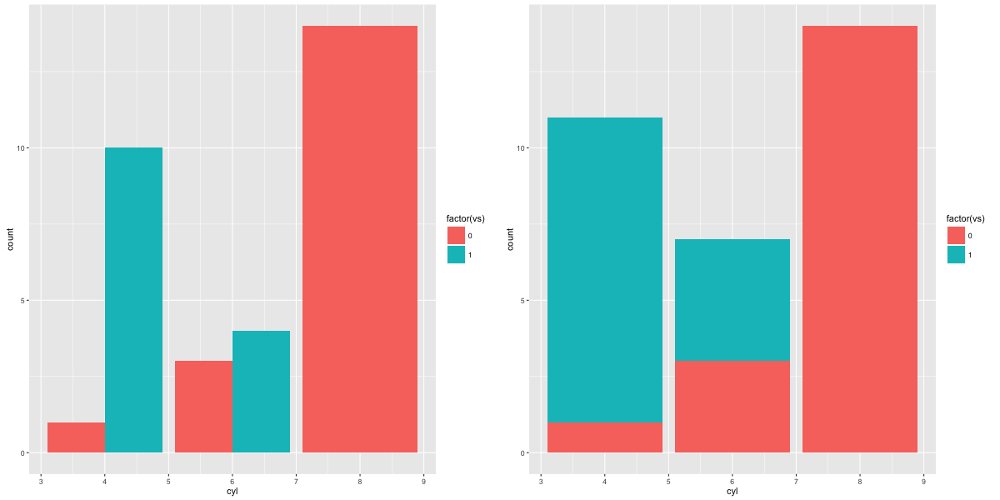

```{r, eval=FALSE}
# Absolute bar chart: Specify both X adn Y axis. Set stat="identity"
df <- aggregate(mtcars$mpg, by=list(mtcars$cyl), FUN=mean)  # mean of mpg for every 'cyl'
names(df) <- c("cyl", "mpg")
head(df)
#>   cyl    mpg
#> 1   4  26.66
#> 2   6  19.74
#> 3   8  15.10

# Y axis is explicit. 'stat=identity'
gg_bar <- ggplot(df, aes(x=cyl, y=mpg)) + 
  geom_bar(stat = "identity")
print(gg_bar)
```

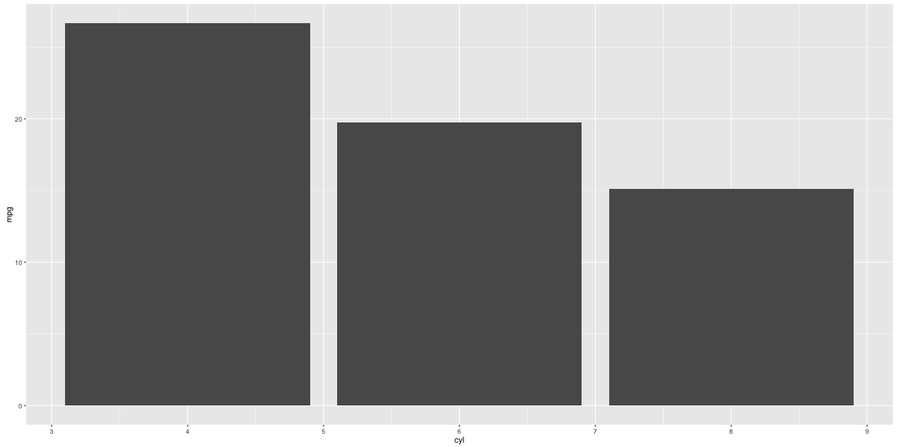

#### Distinct color for bars
```{r, eval=FALSE}    
gg_bar <- ggplot(df, aes(x=cyl, y=mpg)) +
  geom_bar(stat = "identity", aes(fill=cyl))
print(gg_bar)
```

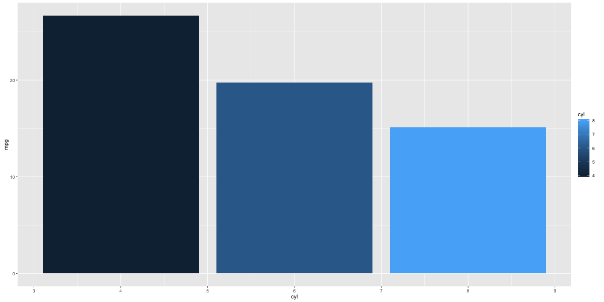

#### Change color and width of bars
```{r, eval=FALSE}    
df$cyl <- as.factor(df$cyl)

gg_bar <- ggplot(df, aes(x=cyl, y=mpg)) +
  geom_bar(stat = "identity", aes(fill=cyl), width = 0.25)

gg_bar + scale_fill_manual(values=c("4"="steelblue",
                                    "6"="firebrick",
                                    "8"="darkgreen"))
```

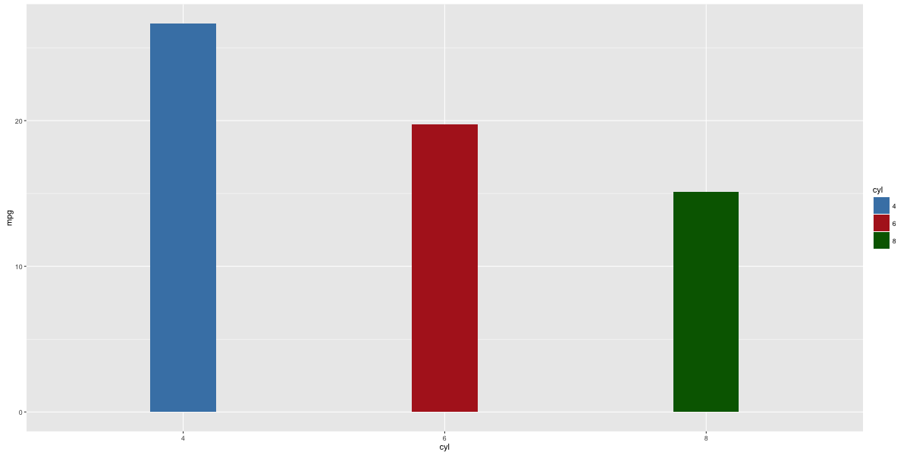

#### Change color palette
```{r, eval=FALSE}    
library(RColorBrewer)

# display available color palettes
display.brewer.all(n=20, exact.n=FALSE)

# "Reds" is palette name
ggplot(mtcars, aes(x=cyl,
                   y=carb,
                   fill=factor(cyl))) + 
  geom_bar(stat="identity") + 
  scale_fill_brewer(palette="Reds")
```

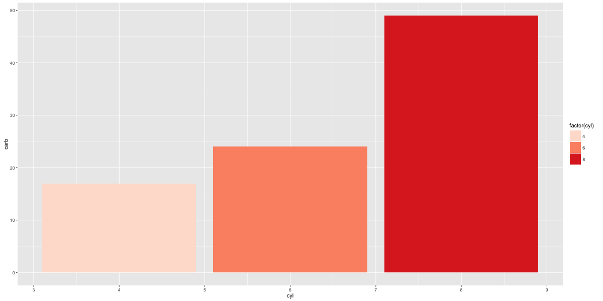

#### Line chart
```{r, eval=FALSE}  
# Method 1:
# setup
gg <- ggplot(economics, aes(x=date))

# No legend
# available linetypes: solid, dashed, dotted, dotdash, longdash and twodash
gg + geom_line(aes(y=psavert),
               size=2,
               color="firebrick") + 
  geom_line(aes(y=uempmed),
            size=1,
            color="steelblue",
            linetype="twodash")
```

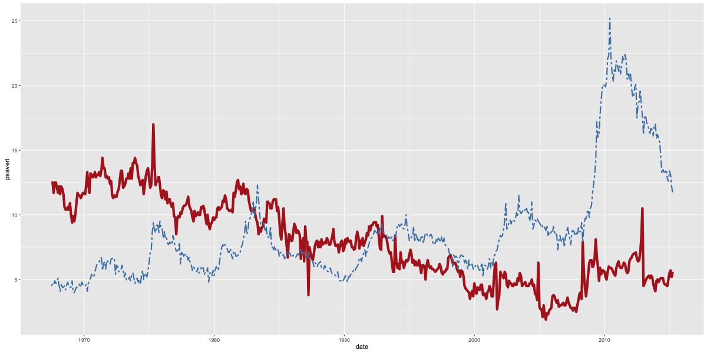


```{r, eval=FALSE}  
# Method 2:
# setup
gg <- ggplot(df_melt, aes(x=date))
gg + geom_line(aes(y=value,
                   color=variable),
               size=1) + 
  scale_color_discrete(name="Legend") # gets legend.
```  

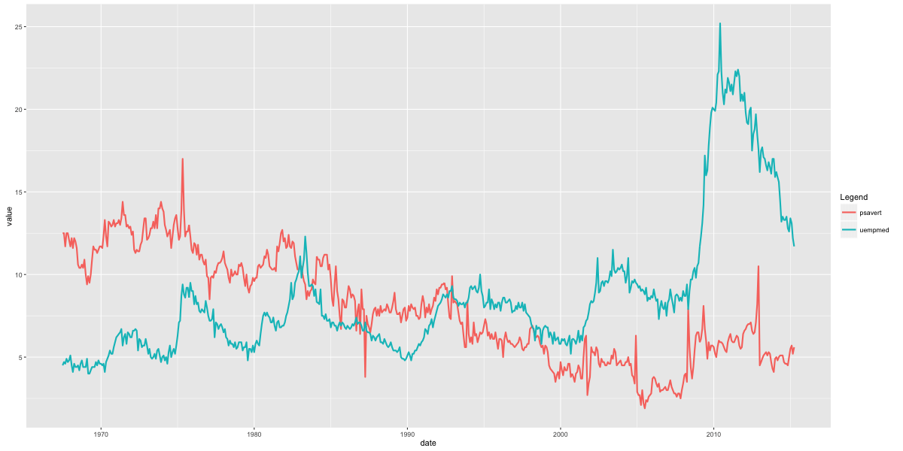

#### Line chart from timeseries
```{r, eval=FALSE}
# One step method.
library(ggfortify)
autoplot(AirPassengers, size=2) + labs(title="AirPassengers")
```

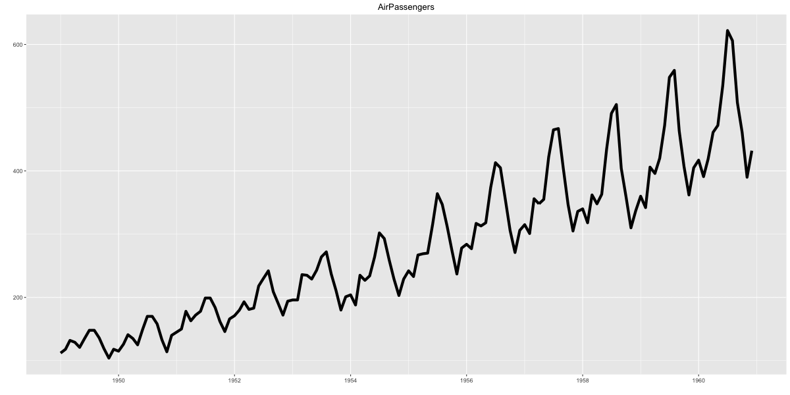


#### Ribbons
Filled time series can be plotted using `geom_ribbon()`. It takes two compulsory arguments `ymin` and `ymax`.
```{r, eval=FALSE} 
# Prepare the dataframe
st_year <- start(AirPassengers)[1]
st_month <- "01"
st_date <- as.Date(paste(st_year, st_month, "01", sep="-"))
dates <- seq.Date(st_date, length=length(AirPassengers), by="month")
df <- data.frame(dates, AirPassengers, AirPassengers/2)
head(df)
#>        dates AirPassengers AirPassengers.2
#> 1 1949-01-01           112            56.0
#> 2 1949-02-01           118            59.0
#> 3 1949-03-01           132            66.0
#> 4 1949-04-01           129            64.5
#> 5 1949-05-01           121            60.5
#> 6 1949-06-01           135            67.5
# Plot ribbon with ymin=0
gg <- ggplot(df, aes(x=dates)) + 
  labs(title="AirPassengers") + 
  theme(plot.title=element_text(size=30),
        axis.title.x=element_text(size=20),
        axis.text.x=element_text(size=15))

gg + geom_ribbon(aes(ymin=0, ymax=AirPassengers)) +
  geom_ribbon(aes(ymin=0, ymax=AirPassengers.2), fill="green")
```

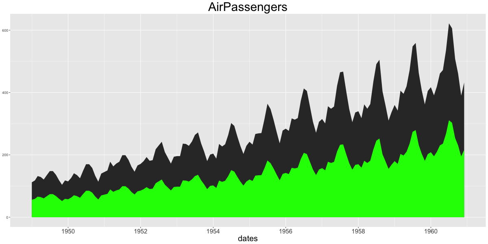


```{r, eval=FALSE} 
gg + geom_ribbon(aes(ymin=AirPassengers-20,
                     ymax=AirPassengers+20)) +

  geom_ribbon(aes(ymin=AirPassengers.2-20,
                  ymax=AirPassengers.2+20),
              fill="green")
```

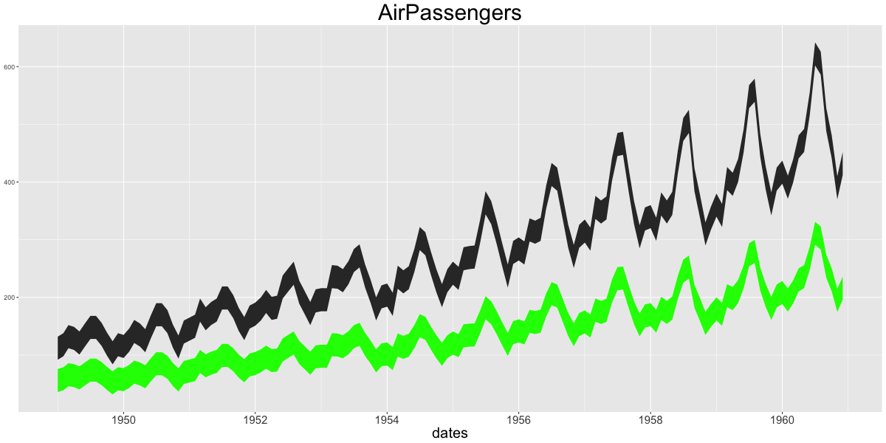


#### Area
`geom_area` is similar to `geom_ribbon`, except that the `ymin` is set to 0. If you want to make overlapping area plot, use the `alpha` aesthetic to make the top layer translucent.
```{r, eval=FALSE}

df <- reshape2::melt(economics[, c("date", "psavert", "uempmed")], id="date")
head(df, 3)
#>         date variable value
#> 1 1967-07-01  psavert  12.5
#> 2 1967-08-01  psavert  12.5
#> 3 1967-09-01  psavert  11.7

# Method1: Non-Overlapping Area
p1 <- ggplot(df, aes(x=date)) +
  geom_area(aes(y=value, fill=variable)) +
  labs(title="Non-Overlapping - psavert and uempmed")

# Method2: Overlapping Area
p2 <- ggplot(economics, aes(x=date)) +
  geom_area(aes(y=psavert), fill="yellowgreen", color="yellowgreen") +
  geom_area(aes(y=uempmed), fill="dodgerblue", alpha=0.7, linetype="dotted") +
  labs(title="Overlapping - psavert and uempmed")
gridExtra::grid.arrange(p1, p2, ncol=2)
```

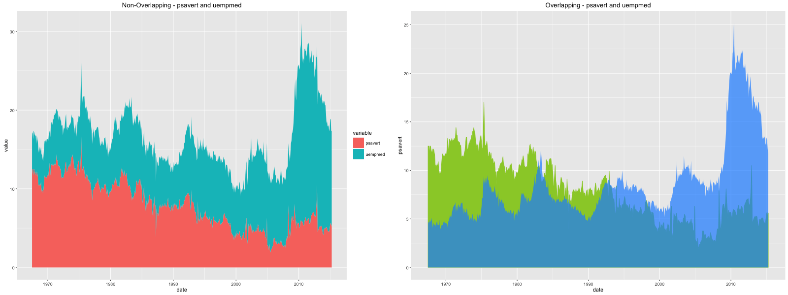


#### Boxplot and Violin
The oulier points are controlled by the following aesthetics:
* outlier.shape
* outlier.stroke
* outlier.size
* outlier.colour

If the `notch` is turned on (by setting it TRUE), the below boxplot is produced. Else, you would get the standard rectangular boxplots.

```{r, eval=FALSE} 
# boxplot
p1 <- ggplot(mtcars, aes(factor(cyl), mpg)) +
  geom_boxplot(aes(fill = factor(cyl)),
               width=0.5,
               outlier.colour = "dodgerblue",
               outlier.size = 4,
               outlier.shape = 16,
               outlier.stroke = 2,
               notch=T) + 
  labs(title="Box plot")

# violin plot
p2 <- ggplot(mtcars, aes(factor(cyl), mpg)) +
  geom_violin(aes(fill = factor(cyl)), width=0.5, trim=F) +
  labs(title="Violin plot (untrimmed)")

gridExtra::grid.arrange(p1, p2, ncol=2)
```

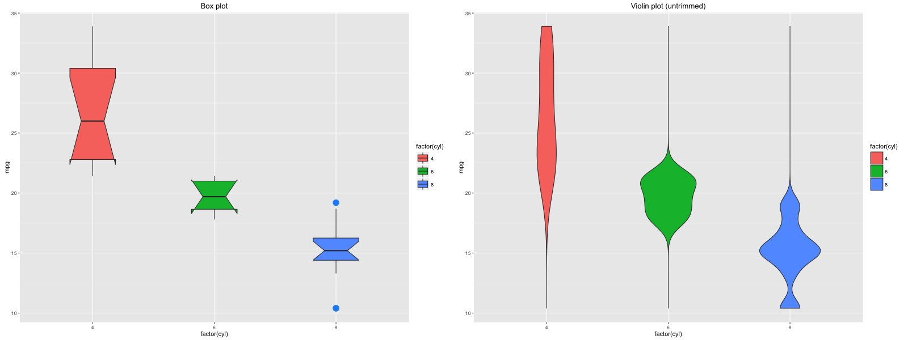

#### Density

```{r, eval=FALSE} 
# Density plot
ggplot(mtcars, aes(mpg)) + 
  geom_density(aes(fill = factor(cyl)), size=2) +
  labs(title="Density plot")
```

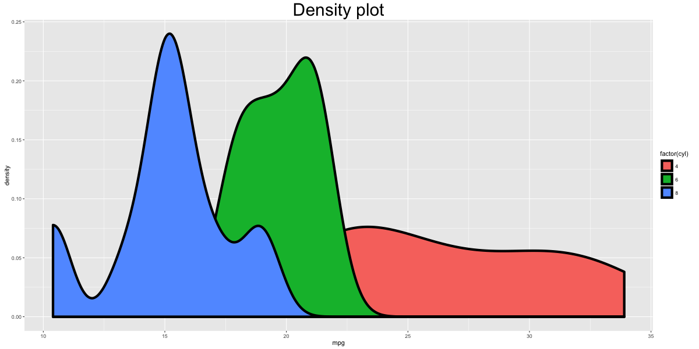


#### Tiles
```{r, eval=FALSE}
corr <- round(cor(mtcars), 2)
df <- reshape2::melt(corr)
gg <- ggplot(df, aes(x=Var1,
                     y=Var2,
                     fill=value,
                     label=value)) +
  geom_tile() +
  theme_bw() +
  geom_text(aes(label=value, size=value), color="white") +
  labs(title="mtcars - Correlation plot") +
  theme(text=element_text(size=20), legend.position="none")

library(RColorBrewer)
p2 <- gg + scale_fill_distiller(palette="Reds")
p3 <- gg + scale_fill_gradient2()
gridExtra::grid.arrange(gg, p2, p3, ncol=3)
```

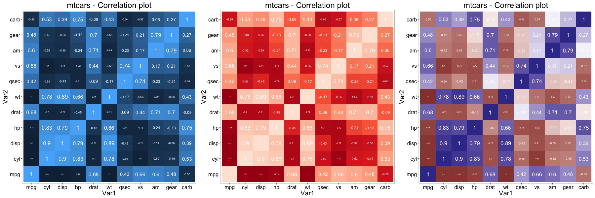
