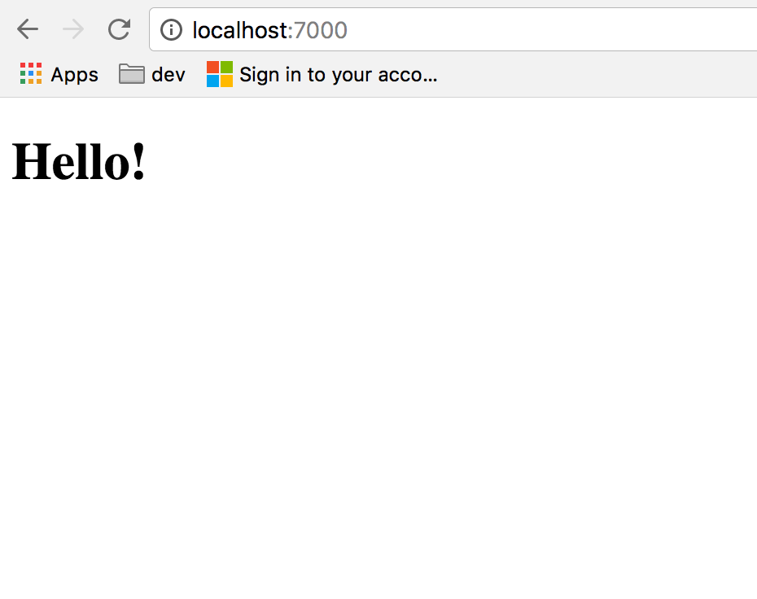
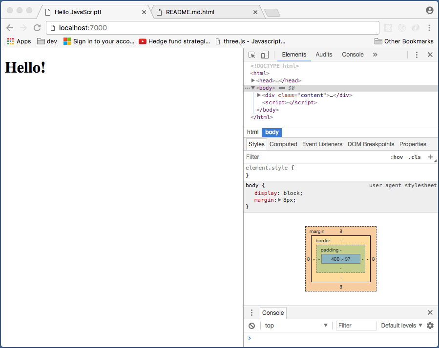
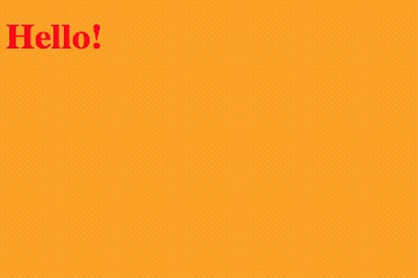
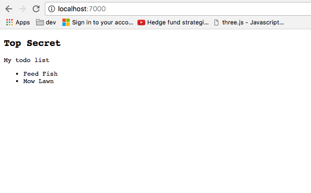
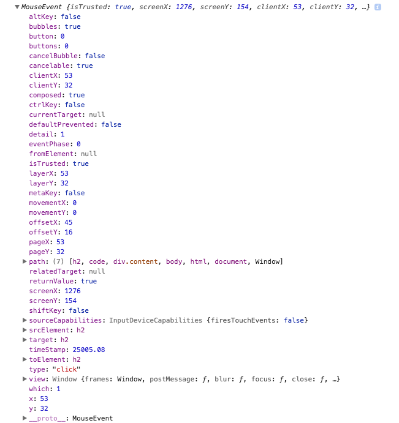
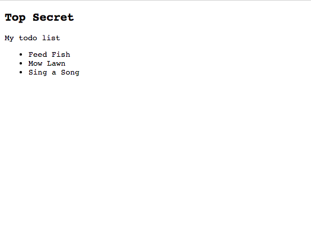
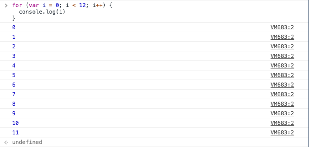
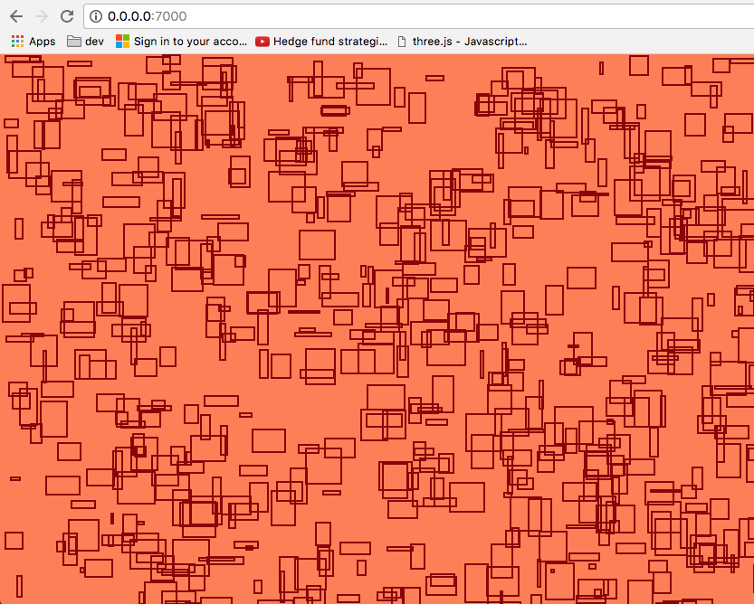
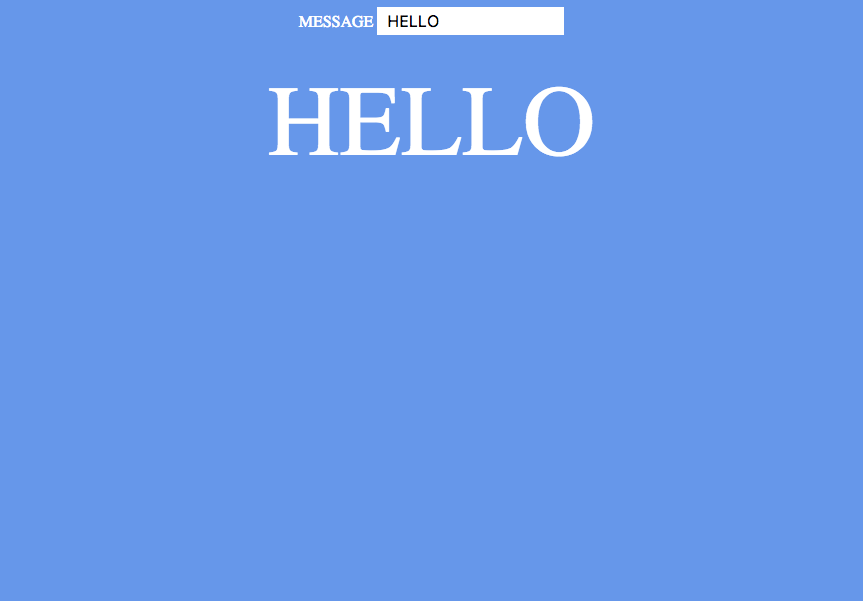

# Intro to JavaScript

JavaScript is a high-level, object-oriented programming language that's easy to learn and fun to use. JavaScript recently became [the most popular programming language in the world](./images/programming_languages.png), perhaps because it powers an enormous range of interactive applications on the web and native devices. This session aims to offer a quick introduction to the power of the JavaScript language.

## Getting Started

To get started, you'll need to install the following dependencies on your development machine:
* [Google Chrome](https://www.google.com/chrome/browser/features.html)
* [Sublime Text](https://www.sublimetext.com/) on your development machine.
* [Python](https://www.python.org/)

Once those are installed, you'll want to create a simple html page into which you can write your JavaScript. To do so, create a file named `index.html` on your desktop and copy the following into that file:

```
<!DOCTYPE html>
<html>
  <head>
    <meta charset='UTF-8'>
    <title>Hello JavaScript!</title>
  </head>
  <body>
    <div class='content'>
      <h1>Hello!</h1>
    </div>

    <script></script>
  </body>
</html>
```

This file above is an example of an HTML document. HTML is the language in which web pages are written. The `<script>` tags in HTML documents are used to include JavaScript on a page. In what follows below, we'll type all of our JavaScript between the opening `<script>` tag and the closing `</script>` tag.

## Starting a web server

Once you've saved your index.html file, we'll want to start a web server on your desktop. To do so, you'll need to open a terminal:

| Operating System | Command |
|---|---|
| OSX | type COMMAND+SPACE_BAR, type <i>terminal</i>, and hit ENTER |
| Windows | go to Programs/Apps -> Anaconda3 -> Anaconda Prompt |

After starting your terminal, we'll need to change directories to your desktop:

| Operating System | Command |
|---|---|
| OSX | `cd ~/Desktop`  |
| Windows | `cd C:\Users\YOUR_USERNAME\Desktop` |

Once your terminal is on your desktop, you can start a local webserver by running:

| Python Version | Command |
|---|---|
| 2.7 | python -m SimpleHTTPServer 7000 |
| 3.x | python -m http.server 7000 |

You can now open Chrome and navigate to `localhost:7000`, which should display a friendly greeting:



If you don't see this greeting, let us know so we can help you!

## Chrome's Developer Tools

After starting Chrome you'll want to open the <b>Chrome developer tools</b>. On OSX, you can access the developer tools by going to `View -> Developer -> Developer Tools`. On Windows, you can click the `three dots in the upper right hand corner -> More Tools -> Developer Tools`.

Once the developer tools are open, click the three dots at the top of the developer tools toolbar, and click `Show console drawer` so you can see your console (we'll discuss this below). Once this is done, the developer tools should look something like this:



We'll discuss the different aspects of the dev tools during the session. For now, let's leave the dev tools open so we can investigate different aspects of the webpage in which we'll type our JavaScript.

## The Power of JavaScript

Let's start with a quick example that shows the power of JavaScript. Open up your Chrome dev tools, find the Console at the bottom of the dev tools, and type:

`document.querySelector('body').style.background = 'orange'`

Voila, the body tag of your page now has a background color orange! Now suppose you want to continually change some aspect of a webpage, such as the color of text on the page. You could do so like this:

```
setInterval(function() {
  var colors = ['red', 'purple', 'green'];
  document.querySelector('h1').style.color = colors[parseInt(Math.random() * 3)]
}, 100)
```

Your page should now look a little spooky:



With just a few lines of JavaScript, you can unlock a tremendous range of dynamic and interactive functionality. To get you started with JavaScript, we'll walk through the basics below.

### Element selections

You will often need to select elements on a page in order to modify their styles or attach event listeners to them. To explore element selections, let's add some things to our web page that we can select. Update your index.html so that it looks like this:

```
<!DOCTYPE html>
<html>
  <head>
    <meta charset='UTF-8'>
    <title>Hello JavaScript!</title>
  </head>
  <body>
    <div class='content'>
      <code>
        <h2>Top Secret</h2>
        <div>My todo list</div>
        <ul>
          <li>Feed Fish</li>
          <li>Mow Lawn</li>
        </ul>
      </code>
    </div>
    <script></script>
  </body>
</html>
```

In Chrome, your web page should now look something like this:


Given that updated webpage, let's practice some element selections. First let's select the `<h2>` tag at the top of the page. To do so, we can use the following syntax :

```
document.querySelector('h2')
```

This function returns an element, which you'll see displayed in your console if you run the line above in Chrome. If we wanted, we could change the matching element's style attributes like so:

```
document.querySelector('h2').style.color = 'red';
```

Here we select the first `<h2>` tag on our page and set its font color to red. We could instead change the text content of the `<h2>` tag by using:

```
document.querySelector('h2').innerHTML = 'Weekend Plans';
```

We can also select multiple elements at once using the following syntax:

```
document.querySelectorAll('li');
```

This line selects all of the li tags on our page. To modify the first `<li>` tag, we can use:

```
document.querySelectorAll('li')[0].style.textDecoration = 'line-through';
```

This line says: Find all `<li>` tags on our page, take the 0-th member of the resulting list (that is, take the first member), and set its textDecoration style attribute to `line-through`.

***

#### CHALLENGE
<b>Given what we've covered above, see if you can use JavaScript to strike-through the second `<li>` tag on the page.</b>

***

### Storing Data in Variables

Some of the lines we wrote above were rather long. For example:

```
document.querySelectorAll('li')[0].style.textDecoration = 'line-through';
```

This line accomplishes its goal, but it's a little hard to read beacuse it chains lots of logic together. We can simplify long lines like this by using variables. Variables allow us to assign a value to a variable name. For example, we can break the line above into:

```
var elements = document.querySelectorAll('li');
elements[0].style.textDecoration = 'line-through';
```

As we see above, to initialize a variable in JavaScript, we must use the `var` syntax before typing out the variable name. We'll use more variables when we discuss event listeners below.

### Adding Event Listeners

Event listeners trigger changes on a page as a result of some user action.

For example, suppose we want to change the color of our Top Secret message to red when users click our page. To do so we can do as follows:

```
// Store the title element in a variable named title
var title = document.querySelector('h2');

// When users click on the title, change its color to red
title.addEventListener('click', function() {
  title.style.color = 'red';
})
```

Here we call the `.addEventListener()` method on an element, which has the following syntax:

`ELEMENT.addEventListener(EVENT_TYPE, CALLBACK_FUNCTION)`

<b>ELEMENT</b> is a selection of an element, such as the result of `document.querySelector('h2');`.

<b>EVENT_TYPE</b> is the type of event that should trigger some change. Here are some commonly used event types [[comprehensive list here](https://developer.mozilla.org/en-US/docs/Web/Events)]:

| Event | Description |
|---|---|
| click | The user clicks an HTML element |
| mouseenter| The user moves the mouse into an HTML element |
| mouseout | The user moves the mouse away from an HTML element |
| keydown | The user pushes a keyboard key |

The <b>CALLBACK FUNCTION</b> defines the lines of code to run when the given event type is triggered. In the example above, our callback function changes the title's color to red. We will explore additional examples of callback functions below.

***

#### CHALLENGE
<b>Given what we've covered above, see if you can add an event listener to your page's `<h2>` element that changes that element's color to green after a user mouses over the element.</b>

***

### Functions

In the last example, we saw an example of a JavaScript function:

```
title.addEventListener('click', function() {
  title.style.color = 'red';
})
```

Here we define a function that looks like this:

```
function() {
  title.style.color = 'red';
}
```

This is an example of an "anonymous" function, as this function is not assigned to a variable name. To make this a "named" function, we can assign our function to a variable name:

```
var colorTitle = function() {
  title.style.color = 'red';
}
```

Here we use the `var` keyword to initialize a variable, as we did above. We then assign our anonymous function to that variable name. After doing so, we can rewrite our event listener as follows:

```
var title = document.querySelector('h2');

var colorTitle = function() {
  title.style.color = 'red';
}

title.addEventListener('click', colorTitle);
```

The last line of this snippet says: when a user initalizes a `click` event on the `title`, call the function assigned to the `colorTitle` variable name. This does exactly what we did above, but this code is a bit easier to read because the lines are shorter and less complex, which is great!

### Event Callbacks

In the example above, our event listener callback function looked like this:

```
var colorTitle = function() {
  title.style.color = 'red';
}
```

We can see here that there is nothing between the parentheses right after the `function` keyword. This means that this function takes no parameters. <b>Parameters</b> are the things we pass into functions--they are also called inputs or arguments. If the function did take parameters, the function would look more like this: `function(parameterOne, parameterTwo) { ... }`.

Functions without parameters are perfectly fine, but we should note that the callback function provided for `.addEventListener()` receives by default a special parameter we should discuss. This special parameter is an `event` object, and it allows us to put together interesting interaction patterns.

To see this in action, let's run the following lines:

```
var colorRed = function(event) {

  // Color the clicked element red
  event.target.style.color = 'red';
}

// Get a selection that targets our page's body tag
var body = document.querySelector('body');

// Add a click listener to the body page of our page
body.addEventListener('click', colorRed);
```

After running those lines in your Chrome dev tools, try clicking some text elements on the page. You should see those elements turn red.

To understand how this works, we need to investigate that special `event` argument that's passed by default to all event listener callback functions. Let's investigate it by running the following lines of code:

```
var colorRed = function(event) {

  // Print out the event object contents
  console.log(event);

  // Color the clicked element red
  event.target.style.color = 'red';
}

var body = document.querySelector('body');

body.addEventListener('click', colorRed);
```

Here we've added the most important JavaScript function to remember: `console.log()`. This function takes as input one or more variables, and it displays each of those variables in the browser's console. That lets you inspect those variables to figure out what's going on inside them, which is tremendously helpful when building real applications.

If you run the lines above and you click a few elements, you should see some output in your console. Those output lines display the contents of the `event` object that's passed to your `colorRed()` function. If you click some of the triangles within that object, you should see that the `event` object has lots of information within it:



There's a lot of information in this event object! The portion we care about right now is the `target` attribute within the event object. The `target` attribute indicates the "target" of a given object--i.e. the element that received the event. If you click the triangle to the left of the word `target`, you'll be able to learn more about the element that received your click object. For now, it's enough to note that `style` is an attribute within `event.target`, which means we can change the style of the clicked element inside of our click listener callback. This is how the code above works!

### Adding Elements to a Page

So far we've discussed modifying elements already on a page, but sometimes you might want to use JavaScript to add new elements to the page. To see how this works, let's add some new elements to the page with the following lines:

```
// Create a new element
var newElement = document.createElement('li');

// Set relevant styles on your new element
newElement.innerHTML = 'Sing a Song';

// Select the element to which you want to append your new element
var target = document.querySelector('ul');

// Add the new element to the page
target.appendChild(newElement);
```

Our todo list now has another item!



***

#### CHALLENGE
<b>Given what we've covered above, see if you can change the text content of each of your todo list's items. Once you accomplish that, see if you can add another todo list item to your page.</b>

***

### Loops

In the examples above, we added a click listener to a single element selection. Sometimes, though, you might want to add click listeners to lots of items all at once. To do so, you'll need to "loop" over your elements and add an event listener to each. Here's an example of this functionality:

```
// Select all of the li tags on the page
var elements = document.querySelectorAll('li');

// Define the callback we'll call when users click an li tag
var linethrough = function(e) {
  e.target.style.textDecoration = 'line-through';
}

// Loop over each li tag
for (var i=0; i<elements.length; i++) {
  var element = elements[i];

  // Add an event listener to the element
  element.addEventListener('click', linethrough)
}
```

Here we loop over our `<li>` tags and add a click listener to each such that when users click the tag, the tag's content will be striken-through.

The interesting part of the code above is the for loop. To understand that for loop, paste the following into Chrome's dev tools:

```
for (var i = 0; i < 12; i++) {
  console.log(i)
}
```

You should get the following output:



Our output starts at 0 and increases to 11. This is because we set our for-loop to start by setting `i` to 0, and continue adding 1 to i (`i++`) while i remains less than 12. In other words, we asked for all values of i from 0 to 11, which is what we get, one-by-one, inside the body of the for loop.

***

#### CHALLENGE
<b>Given what we've covered above, see if you can write a for loop that counts from 0 to 100. The last value printed to the console should be 100, not 99!</b>

***

### Loading JavaScript Files

So far, we've typed our JavaScript code into Chrome's developer tools. That's a great way to test out ideas, but the vast majority of the time you'll write your JavaScript code into a `.js` file and will load that file into a given webpage.

Let's practice that idea by creating a new file named `myscript.js` with the following content:

```
console.log('begin!');
var body = document.querySelector('body');
body.style.background = 'coral';
```

Then let's load that file into our webpage by editing `index.html` so it looks like this:

```
<!DOCTYPE html>
<html>
  <head>
    <meta charset='UTF-8'>
    <title>Hello JavaScript!</title>
  </head>
  <body>
    <div class='content'>
    </div>
    <script src='myscript.js'></script>
  </body>
</html>
```

If you reload `localhost:7000`, you should see your script has changed your page's background color, just as expected. From now on, feel free to save your changes in your external `.js` file and reload the page to see the changes. If you prefer running code in Chrome's dev tools instead, that's okay too.

### Adding Multiple Elements to a Page

So far we've added elements to our page one-by-one, but sometimes you'll want to add lots of elements to your page at the same time. Let's practice this behavior by combining for loops and element creation.

First, let's write a function that adds a rectangle to the page:

```
// Define a function that adds an element to the page
var addElement = function() {
  // Create the base element we'll add to our page
  var elem = document.createElement('div');
  
  // Give the element a random width and height
  elem.style.width = Math.random() * 40 + 'px';
  elem.style.height = Math.random() * 40 + 'px';

  // Give the element a random position on the page
  elem.style.position = 'absolute';
  elem.style.left = Math.random() * window.innerWidth + 'px';
  elem.style.top = Math.random() * window.innerHeight + 'px';

  // Give the element a 2 pixel-wide dark red border 
  elem.style.border = '2px solid darkred';

  // Add the element to the page
  document.body.appendChild(elem);
}

// Let's change our document's background color:
document.querySelector('body').style.background = 'coral';

// Now let's run that function 1000 times:
for (var i=0; i<1000; i++) {
  addElement();
}
```

Et voila, an abstract painting:



### Timers

All of the events we've issued in the lines above were executed immediately. Sometimes, though, it's helpful to run an event after a certain amount of time has elapsed. There are two popular ways researchers achieve this effect: `setTimeout` and `setInterval`. The former calls a function after a set number of milliseconds; the latter calls a function continually every n milliseconds.

To see setInterval in action, let's add a series of circles to our page one by one:

```
var addCircle = function() {
  
  // Create a circle element
  var elem = document.createElement('div');

  // Give the element a size;
  elem.style.width = '10px';
  elem.style.height = '10px';

  // Give the element a random position on the page
  elem.style.position = 'absolute';
  elem.style.left = window.innerWidth * Math.random() + 'px';
  elem.style.top = window.innerHeight * Math.random() + 'px';
  
  // Give the element a white background and make it a circle
  elem.style.background = 'white';
  elem.style.borderRadius = '100%';

  // Add the element to the page
  document.body.appendChild(elem);
}

// Make the background green
document.querySelector('body').style.background = 'cadetblue';

// Call the addCircle function every 4 milliseconds
setInterval(addCircle, 4)
```


### Interacting with UI Elements

Many times it's helpful to read the current "state" of user interface elements such as input boxes, selects, or checkboxes using JavaScript. Let's practice some of this work below.

First let's update our `index.html` page so it looks like this:

```
<!DOCTYPE html>
<html>
  <head>
    <meta charset='UTF-8'>
    <title>Hello JavaScript!</title>
    <style>
    * {
      color: #fff;
      background: cornflowerblue;
      text-align: center;
      font-size: 16px;
      border: none;
    }

    input {
      padding: 5px 10px;
      color: #000;
      background: #fff;
      text-align: left;
    }

    #target {
      font-size: 100px;
      padding-top: 30px;
    }
    </style>
  </head>
  <body>
    <label>MESSAGE</label>
    <input type='text' value='HELLO'></input>
    <div id='target'>HELLO</div>
  </body>
</html>
```

Your page should now look like this:



Now let's add an event listener to our text input such that when the text input changes, we change the text displayed on the page:

```
var handleInputChange = function(e) {
  
  // Get the new value of the input
  var value = e.target.value;

  // Set the target's text content to the input's content
  var target = document.querySelector('#target');
  target.innerHTML = value;
}

// Select the input box
var input = document.querySelector('input');

// Add an event listener that calls a function when the input changes
input.addEventListener('keyup', handleInputChange);
```

If you run those lines in Chrome's dev tools then type into your input box, you should see the text on your page change. This is one way to respond to user input with JavaScript!

### Going Further

We've just scratched the surface of JavaScript's powers here. If you want to go further, some great introductory resources include:

* [Codecademy](https://www.codecademy.com/) Codecademy has fun, free lessons on lots of programming languages and topics, including JavaScript and popular JavaScript libraries (jQuery, Angular.js, and React.js).  
* [MDN](https://developer.mozilla.org/en-US/docs/Web/JavaScript) The defacto source of web documentation for most web programmers.  
* [Codepen](https://codepen.io/) A website that hosts little snippets of HTML, CSS, and JavaScript that you can study and learn from.  
* [DHLAB Office Hours](http://web.library.yale.edu/dhlab/officehours) Come to our office hours and program with a group of peers! We have coffee...
