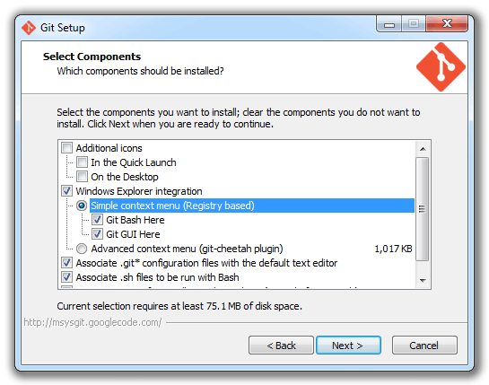

## Web Scraping Cheatsheet

### Desired Operating System: Unix

Machines that run on Unix operating systems (including OSX, RedHat, Ubuntu) have access to a wide range of terminal commands that help make web scraping easy. We will use some linux commands below, so if you don't have access to a Unix machine, please read below.

Macs run on Unix, but Windows machines don't. If you are on a Windows operating system, you can gain access to a computer with a Unix operating system through Amazon Web Services. 

To do so, you can [download Git here](https://git-scm.com/downloads). During the installation process, make sure to keep the box checked to install "Git Bash", and to allow the "Git Bash Here" functionality:



Once Git Bash is installed, right click on your desktop and click "Git Bash Here". In the terminal that appears, type: 

```ssh -i web_scraping.pem ubuntu@ec2-52-37-225-219.us-west-2.compute.amazonaws.com```

To run this command, you will need a special file (web_scraping.pem) that allows you to access the machine. Please just ask a member of the DHLab and we can give you access to this file. This file must be present on your desktop for you to ssh to the remote machine.

### Web Scraping with Unix

To obtain the full content of a **single web page**, one can run the following command:

```wget http://www.google.com```

After running this command, you'll see a file named index.html in your current directory. This file contains the full html content of Google's main page. 

To obtain the full content of **multiple web pages on a single domain**, one can run the following command:

```wget -r -l 4 http://www.google.com```

This command says: Go to google.com, retrieve the content of that page, then find all of the links within the page and follow those links. Then repeat the same operation, continuing in this recursive (designated by `-r`) fashion a maximum number of 4 times (designated by `-l 4`). 

### Web Scraping with Python

Unix commands are great for fetching lots of data quickly, but many pages require more flexible tools. Python provies a number of these tools. The secions below detail some of the ways users can request and process web-hosted content using Python.

#### Requesting web pages with urllib2

The [urllib2 library](https://docs.python.org/2/howto/urllib2.html) contains many helper functions for interacting with web-hosted content. The following snippet, for instance, requests the content of a page and stores the response in a variable:

```
import urllib2

response = urllib2.urlopen('http://www.google.com')
html = response.read()
print html
```

#### Parsing HTML with BeautifulSoup

There are a number of great libraries in Python for obtaining plaintext content from web pages. The most popular is [Beautiful Soup](https://www.crummy.com/software/BeautifulSoup/). The following snippet uses BeautifulSoup to retrieve all the plaintext content within a page:

```
# pip install bs4
import urllib2
from bs4 import BeautifulSoup

# Request the html page
response = urllib2.urlopen('http://www.google.com')
html = response.read()

# Transform the html into a BeautifulSoup object
soup = BeautifulSoup(html)

# Extract all style, script, and head elements from the page
[s.extract() for s in soup(['style', 'script', 'head'])]

# Print each plaintext element on a unique line
print soup.getText(separator = "\n")
```

Using Beautiful Soup, one can also parse out fields of interest within a page. For instance, one can parse out the plaintext content between two specified tags:

```
# pip install bs4
import urllib2, html2text
from bs4 import BeautifulSoup

response = urllib2.urlopen('http://ustc.ac.uk/index.php/record/116631')
html = response.read()

soup = BeautifulSoup(html, "html5lib")

# specify the node from which you wish to extract content
for node in soup.findAll('p'):
  p_content = ''.join(node.findAll(text=True))
  print p_content
```

#### Using Unix Commands in Python

Sometimes it's important to be able to submit Unix commands through Python. For instance, suppose one wanted to request pages from a domain at a rate of 2 requests per minute. One could do so in the following way:

```
import os, time

# request a total of 100 pages
for integer_value in xrange(100):

  request = "http://ustc.ac.uk/index.php/record/" + str(integer_value)
  response = os.popen("curl '" + request + "'").read()

  # write the response to disk
  with open("response_" + str(integer_value) + ".txt", "w") as out:
    out.write(response)

  time.sleep(30)
```

#### Wrapping Up

I hope some of the above options can help get us started as we work to fetch content of interest to workshop participants! If you get involved in web scraping and want to talk further about the possibilities, please feel free to write the DHLab@Yale any time. 
